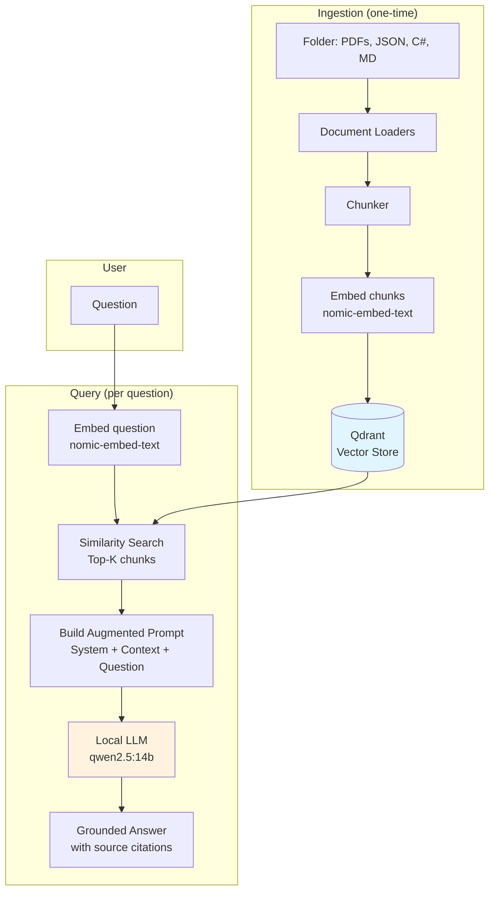

# RAG Pipeline — Implementation Plan

> **Goal:** Ingest a folder of files (PDF, JSON, C#, Markdown, images), embed them locally,
> store vectors in a local vector database, and use semantic search + local LLM to answer
> questions with grounded, hallucination-resistant context.
>
> **Everything runs locally** — no cloud services required.

---

## Phase 0 — Infrastructure (Docker + Qdrant)

**Add Qdrant vector database** to the existing Docker Compose setup.

### What to do

1. Add `qdrant` service to `infra/docker/docker-compose.yml`
2. Expose REST API on port `6333`, gRPC on `6334`
3. Mount a named volume `qdrant-data` for persistence
4. Verify with `curl http://localhost:6333/dashboard`

### docker-compose addition

```yaml
  qdrant:
    image: qdrant/qdrant:latest
    container_name: agenticlab-qdrant
    ports:
      - "6333:6333"   # REST API + Dashboard
      - "6334:6334"   # gRPC
    volumes:
      - qdrant-data:/qdrant/storage
    restart: unless-stopped
    healthcheck:
      test: ["CMD", "curl", "-f", "http://localhost:6333/healthz"]
      interval: 30s
      timeout: 10s
      retries: 3

volumes:
  qdrant-data:   # add to existing volumes block
```

### Verification

- Qdrant dashboard: `http://localhost:6333/dashboard`
- Ollama already running: `http://localhost:11434`
- Embedding model already pulled: `nomic-embed-text` (768-dim vectors)

---

## Phase 1 — Core Abstractions

**New interfaces in `AgenticLab.Core/Abstractions/`**

### 1.1 IEmbeddingModel

```
File: src/AgenticLab.Core/Abstractions/IEmbeddingModel.cs
```

```csharp
public interface IEmbeddingModel
{
    string Name { get; }
    int Dimensions { get; }
    Task<float[]> EmbedAsync(string text, CancellationToken cancellationToken = default);
    Task<float[][]> EmbedBatchAsync(IReadOnlyList<string> texts, CancellationToken cancellationToken = default);
}
```

- Single text → single vector
- Batch support for efficient bulk ingestion
- `Dimensions` exposes vector size (768 for nomic-embed-text)

### 1.2 IVectorStore

```
File: src/AgenticLab.Core/Abstractions/IVectorStore.cs
```

```csharp
public interface IVectorStore
{
    Task InitializeAsync(string collectionName, int dimensions, CancellationToken cancellationToken = default);
    Task UpsertAsync(string collectionName, IReadOnlyList<VectorDocument> documents, CancellationToken cancellationToken = default);
    Task<IReadOnlyList<VectorSearchResult>> SearchAsync(string collectionName, float[] queryVector, int topK = 5, CancellationToken cancellationToken = default);
    Task DeleteCollectionAsync(string collectionName, CancellationToken cancellationToken = default);
}
```

### 1.3 New data models

```
File: src/AgenticLab.Core/Models/VectorDocument.cs
File: src/AgenticLab.Core/Models/VectorSearchResult.cs
File: src/AgenticLab.Core/Models/DocumentChunk.cs
```

```csharp
// VectorDocument — a chunk with its embedding, ready for storage
public class VectorDocument
{
    public required string Id { get; init; }
    public required float[] Vector { get; init; }
    public required string Text { get; init; }
    public Dictionary<string, string>? Metadata { get; init; }
}

// VectorSearchResult — a search hit with similarity score
public class VectorSearchResult
{
    public required string Id { get; init; }
    public required string Text { get; init; }
    public required double Score { get; init; }
    public Dictionary<string, string>? Metadata { get; init; }
}

// DocumentChunk — a piece of a document before embedding
public class DocumentChunk
{
    public required string Id { get; init; }
    public required string Text { get; init; }
    public required string SourceFile { get; init; }
    public int ChunkIndex { get; init; }
    public Dictionary<string, string>? Metadata { get; init; }
}
```

---

## Phase 2 — Embedding Model Adapter

**New class in `AgenticLab.Models/Ollama/`**

```
File: src/AgenticLab.Models/Ollama/OllamaEmbeddingModel.cs
```

Calls Ollama `POST /api/embed` endpoint:

```
POST http://localhost:11434/api/embed
{
  "model": "nomic-embed-text",
  "input": ["text to embed"]
}

Response:
{
  "model": "nomic-embed-text",
  "embeddings": [[0.012, -0.045, ...]]   // 768 floats per input
}
```

### Key design decisions

- Uses `nomic-embed-text` by default (768 dimensions, good quality-to-speed ratio)
- Batch endpoint — send multiple texts, get multiple vectors in one call
- Implements `IEmbeddingModel` interface

---

## Phase 3 — Vector Store Adapter (Qdrant)

**New project: `AgenticLab.VectorStores`**  
(or add to existing `AgenticLab.Models` — depends on preference)

```
File: src/AgenticLab.VectorStores/Qdrant/QdrantVectorStore.cs
```

Calls Qdrant REST API:

| Operation | Endpoint | Method |
|-----------|----------|--------|
| Create collection | `/collections/{name}` | PUT |
| Upsert points | `/collections/{name}/points` | PUT |
| Search | `/collections/{name}/points/search` | POST |
| Delete collection | `/collections/{name}` | DELETE |

### Key design decisions

- Pure HTTP client — no Qdrant NuGet SDK needed (keeps dependencies minimal)
- Creates collection with cosine distance metric
- Stores chunk text and metadata in Qdrant payload
- Implements `IVectorStore` interface

---

## Phase 4 — Document Ingestion Pipeline

**New project or namespace: `AgenticLab.Ingestion`**

### 4.1 Document Loaders

```
src/AgenticLab.Ingestion/Loaders/
  ├── IDocumentLoader.cs
  ├── TextFileLoader.cs       // .cs, .json, .md, .txt, .yaml
  ├── PdfLoader.cs            // uses UglyToad.PdfPig NuGet
  └── ImageLoader.cs          // uses Ollama vision model (llava) or Tesseract OCR
```

Each loader: `file path → raw text string`

### 4.2 Chunking Strategies

```
src/AgenticLab.Ingestion/Chunking/
  ├── IChunker.cs
  ├── FixedSizeChunker.cs          // N tokens/chars with overlap
  └── SemanticBoundaryChunker.cs   // Split at paragraph/method/class boundaries
```

Each chunker: `raw text → List<DocumentChunk>`

### 4.3 Ingestion Pipeline (orchestrator)

```
src/AgenticLab.Ingestion/IngestionPipeline.cs
```

```
folder path
    → enumerate files
    → select loader per file type
    → extract text
    → chunk text
    → embed chunks (IEmbeddingModel)
    → store vectors (IVectorStore)
```

### File type → loader mapping

| Extension | Loader | NuGet Package |
|-----------|--------|---------------|
| `.cs`, `.json`, `.md`, `.txt`, `.yaml`, `.xml` | `TextFileLoader` | (none) |
| `.pdf` | `PdfLoader` | `UglyToad.PdfPig` |
| `.png`, `.jpg`, `.bmp` | `ImageLoader` | `Tesseract` or Ollama `llava` |

---

## Phase 5 — RAG Agent

**New agent in `AgenticLab.Agents/`**

```
File: src/AgenticLab.Agents/RagAgent.cs
```

### Query flow

```
User question
    → embed question (IEmbeddingModel)
    → search vector store (IVectorStore) → top-K chunks
    → build augmented prompt:
        SYSTEM: Answer based ONLY on the provided context.
                If the answer is not in the context, say "I don't have
                enough information to answer that."
                Cite the source file for each claim.

        CONTEXT:
        [Source: src/Repos/OrderRepo.cs, Chunk 3]
        public class OrderRepository { ... }

        [Source: docs/api-guide.pdf, Chunk 12]
        The order validation process requires...

        QUESTION: {user's question}
    → send to LLM (IModel — existing OllamaModel)
    → return grounded answer with source citations
```

### Add to SpecialistAgents factory

Add `"RagSearch"` specialist type with a system prompt optimized for context-grounded answering.

---

## Phase 6 — Demo Integration

**Update `AgenticLab.Demos/Program.cs`**

### Demo flow

1. Start → check Qdrant + Ollama health
2. Ingest demo folder (`data/rag-demo/`) into a `"demo"` collection
3. Interactive loop: user types questions → RAG agent searches + answers
4. Show retrieved chunks + scores alongside the LLM answer

### Console output example

```
╔══════════════════════════════════════╗
║       AgenticLab — RAG Demo         ║
╚══════════════════════════════════════╝

Ingesting data/rag-demo/ ...
  ✓ company-handbook.md     → 12 chunks
  ✓ product-catalog.json    → 8 chunks
  ✓ OrderRepository.cs      → 5 chunks
  ✓ invoice-template.pdf    → 3 chunks
Total: 28 chunks embedded and stored in Qdrant.

Type a question (or 'quit' to exit):
> What is the return policy?

Retrieved 3 relevant chunks:
  1. [company-handbook.md, chunk 7] score: 0.89
  2. [company-handbook.md, chunk 8] score: 0.82
  3. [product-catalog.json, chunk 3] score: 0.61

[RagSearch]: Based on the company handbook, the return policy allows
returns within 30 days of purchase with original receipt...
Source: company-handbook.md
```

---

## Implementation Order & Dependencies

```
Phase 0 ──→ Phase 1 ──→ Phase 2 ──→ Phase 3 ──→ Phase 4 ──→ Phase 5 ──→ Phase 6
Docker       Core        Ollama      Qdrant       Ingest      Agent       Demo
Qdrant       Interfaces  /api/embed  REST client  Pipeline    RagAgent    Program.cs
                                                  Loaders
                                                  Chunkers
```

### New NuGet packages needed

| Package | Purpose | Phase |
|---------|---------|-------|
| `UglyToad.PdfPig` | PDF text extraction | Phase 4 |
| `Tesseract` (optional) | Image OCR | Phase 4 |

### New projects/files summary

| Phase | New Files |
|-------|-----------|
| 0 | `docker-compose.yml` (edit) |
| 1 | `IEmbeddingModel.cs`, `IVectorStore.cs`, `VectorDocument.cs`, `VectorSearchResult.cs`, `DocumentChunk.cs` |
| 2 | `OllamaEmbeddingModel.cs` |
| 3 | `AgenticLab.VectorStores` project, `QdrantVectorStore.cs` |
| 4 | `AgenticLab.Ingestion` project, loaders, chunkers, `IngestionPipeline.cs` |
| 5 | `RagAgent.cs`, `SpecialistAgents.cs` (edit) |
| 6 | `Program.cs` (edit or new RAG demo) |

---

## Architecture Diagram



---

## Key Decisions & Trade-offs

| Decision | Choice | Why |
|----------|--------|-----|
| Vector DB | Qdrant (Docker) | Best REST API, dashboard, no SDK needed, fast |
| Embedding model | nomic-embed-text | Already in your Docker init, 768-dim, good quality |
| Generation model | qwen2.5:14b | Your recommended dev model, good at following instructions |
| PDF extraction | PdfPig | Pure C#, no native dependencies, MIT license |
| Communication | REST/HTTP | Consistent with existing OllamaModel pattern, no extra SDKs |
| Chunk size | 512 tokens, 64 overlap | Good balance of context vs. specificity |
| Top-K | 5 | Enough context without exceeding qwen2.5's 32K context window |
