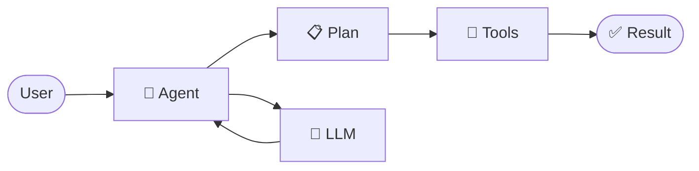
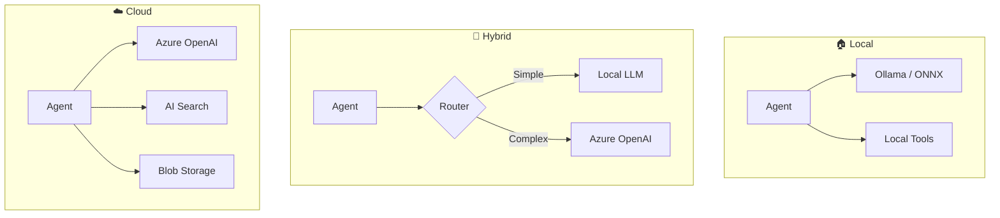
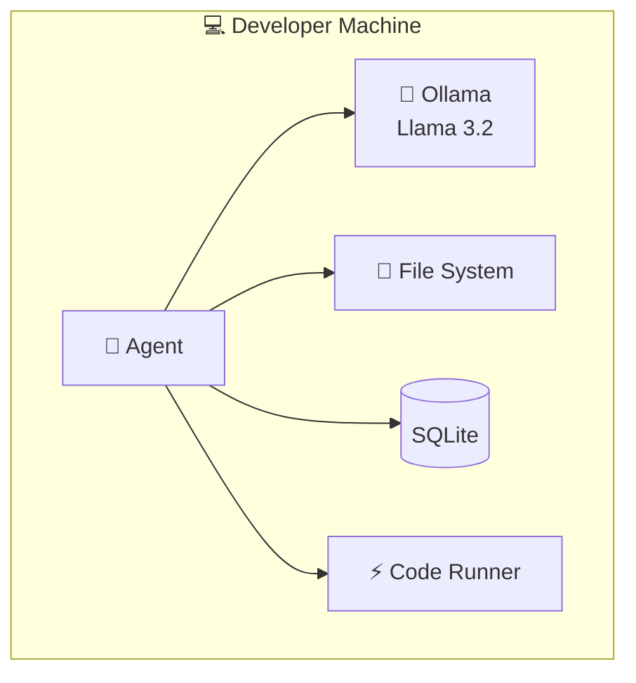
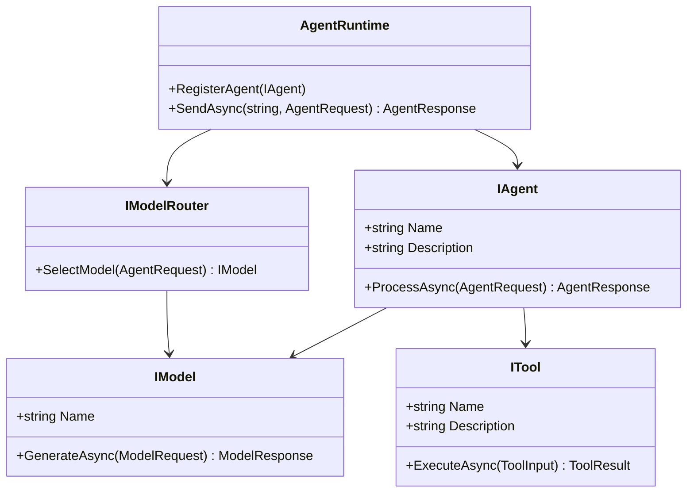
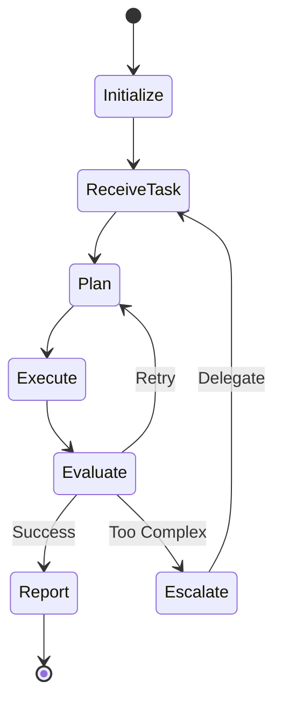
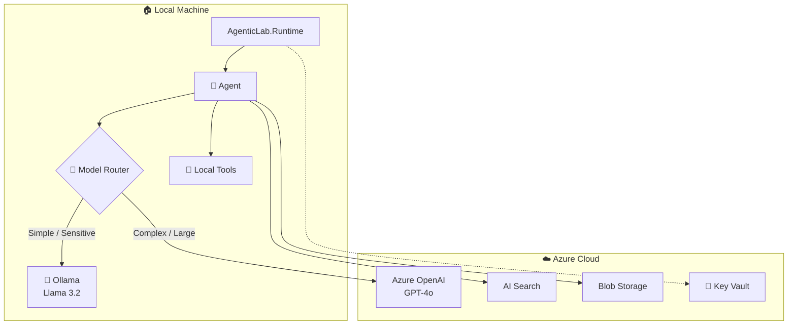
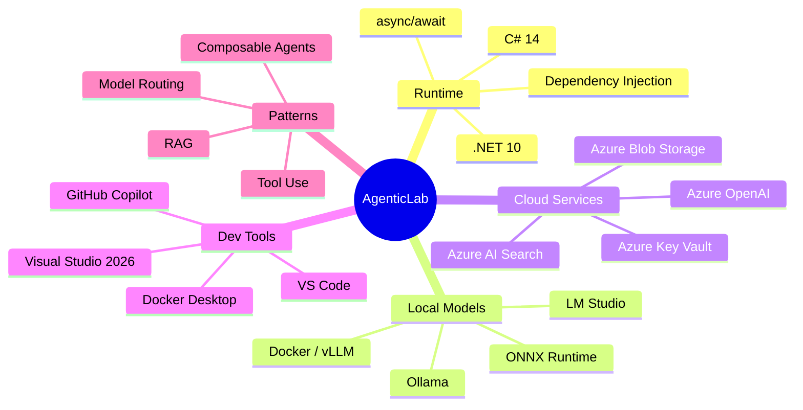
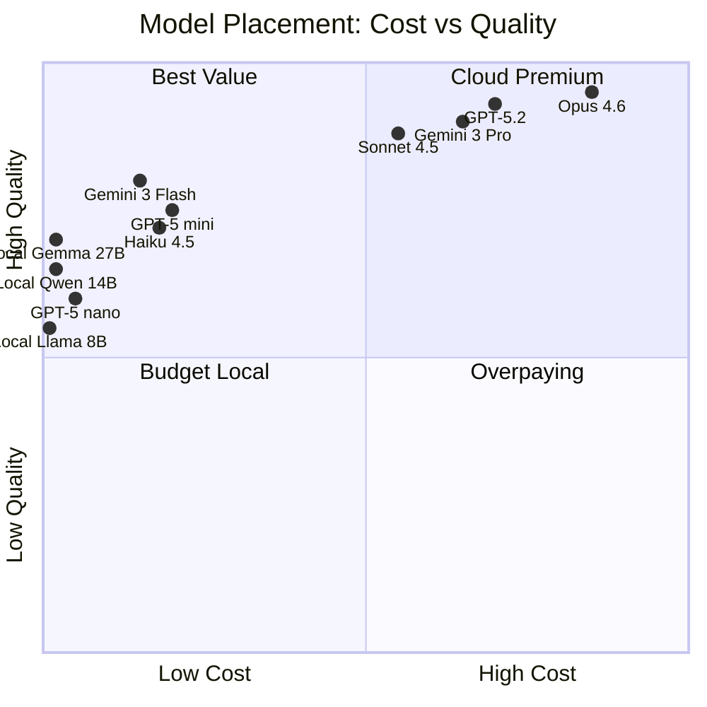
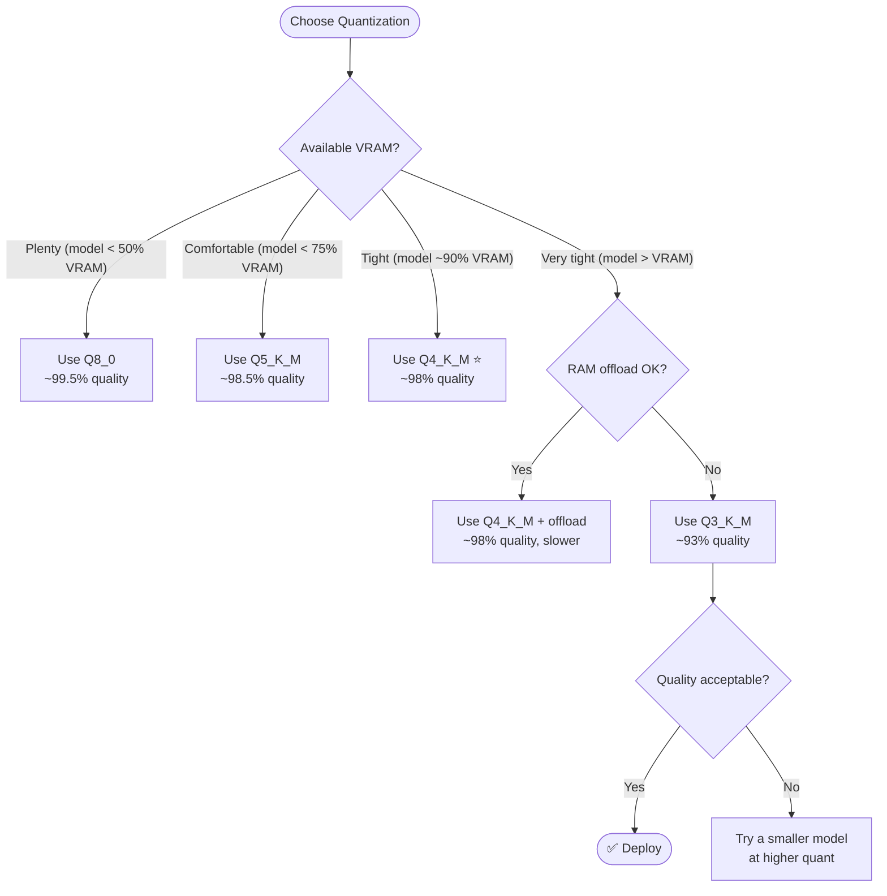
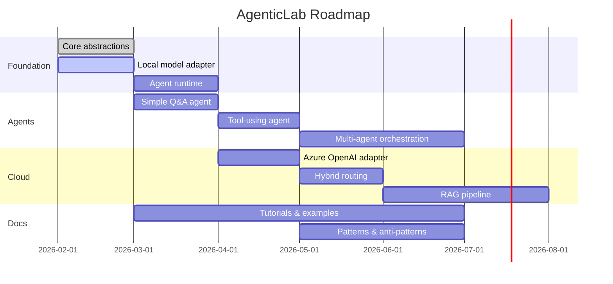

# AgenticLab — Presentation Deck

> A markdown-based slide deck covering agentic system concepts, architecture, and implementation patterns.

---

## Slide 1: What is an Agentic System?

An **agentic system** is a software architecture where autonomous agents:

- Receive goals or tasks
- Plan and reason about how to achieve them
- Use tools and APIs to take actions
- Collaborate with other agents
- Produce results with minimal human intervention



---

## Slide 2: Why .NET for Agents?

| Strength | Benefit |
|----------|---------|
| **Strong typing** | Reduces runtime errors in orchestration |
| **Dependency injection** | Built into the framework |
| **Performance** | Native AOT, minimal memory footprint |
| **Ecosystem** | Azure AI, Semantic Kernel, ML.NET |
| **Cross-platform** | Windows, Linux, macOS, containers |

> .NET gives us the **engineering rigor** needed for reliable agent orchestration.

---

## Slide 3: The Three Deployment Models



| Mode | Cost | Privacy | Capability | Offline |
|------|------|---------|------------|---------|
| **Local** | Free | Full | Limited | Yes |
| **Hybrid** | Low | Partial | High | Degraded |
| **Cloud** | Variable | Shared | Highest | No |

---

## Slide 4: Local-First Philosophy

> *"Design for the developer machine first. Cloud is an upgrade, not a requirement."*

- **Zero cloud cost** — everything runs on your laptop
- **Data privacy** — nothing leaves the machine
- **Fast iteration** — no network latency
- **Offline capable** — works on a plane
- **Full control** — debug everything locally



---

## Slide 5: Core Components



| Component | Responsibility |
|-----------|---------------|
| **IAgent** | Autonomous unit with a goal and tools |
| **ITool** | A capability an agent can invoke |
| **IModel** | LLM backend (local or cloud) |
| **IModelRouter** | Routes requests to the best model |
| **AgentRuntime** | Orchestrates agent execution |

---

## Slide 6: Agent Lifecycle



1. **Initialize** — configure agent with identity, tools, model
2. **Receive Task** — accept a goal or message
3. **Plan** — determine steps to achieve the goal
4. **Execute** — invoke tools and models
5. **Evaluate** — check results against goals
6. **Report** — return output or escalate to another agent

---

## Slide 7: Hybrid Architecture Deep Dive



### Routing Rules

| Criteria | Route | Why |
|----------|-------|-----|
| Simple classification | **Local** | Fast, free, private |
| Sensitive data | **Local** | Data stays on-machine |
| Code generation | **Cloud** | Higher quality |
| Complex reasoning | **Cloud** | Larger model |
| Batch processing | **Local** | Cost optimization |

---

## Slide 8: Technology Stack



---

## Slide 9: Project Structure

```text
agenticlab/
├─ docs/               📄 Documentation & presentations
│  ├─ architecture/    🏗️ Architecture docs & diagrams
│  ├─ tutorials/       📚 Step-by-step guides
│  ├─ examples/        💡 Code example index
│  └─ notes/           📝 Glossary & references
│
├─ src/                💻 Source code
│  ├─ AgenticLab.Core/      Core abstractions
│  ├─ AgenticLab.Runtime/   Orchestration engine
│  ├─ AgenticLab.Models/    LLM adapters
│  ├─ AgenticLab.Agents/    Agent implementations
│  └─ AgenticLab.Demos/     Demo applications
│
├─ infra/              ⚙️ Infrastructure
│  ├─ docker/          Local LLM containers
│  ├─ local/           Local configs
│  └─ azure/           Cloud deployment
│
└─ .github/            🔧 GitHub config
   ├─ copilot-instructions.md
   └─ workflows/
```

---

## Slide 10: Code Example — Simple Agent

```csharp
public class SimpleQuestionAgent : IAgent
{
    private readonly IModel _model;

    public string Name => "SimpleQuestion";
    public string Description => "Answers questions using an LLM";

    public SimpleQuestionAgent(IModel model) => _model = model;

    public async Task<AgentResponse> ProcessAsync(
        AgentRequest request, CancellationToken ct = default)
    {
        var response = await _model.GenerateAsync(new ModelRequest
        {
            Prompt = request.Message,
            SystemPrompt = "You are a helpful assistant.",
            MaxTokens = 500,
            Temperature = 0.7
        }, ct);

        return new AgentResponse
        {
            AgentName = Name,
            Message = response.Text,
            Success = true
        };
    }
}
```

---

## Slide 11: Code Example — Model Router

```csharp
public class HybridModelRouter : IModelRouter
{
    private readonly IModel _localModel;
    private readonly IModel _cloudModel;

    public HybridModelRouter(IModel localModel, IModel cloudModel)
    {
        _localModel = localModel;
        _cloudModel = cloudModel;
    }

    public IModel SelectModel(AgentRequest request)
    {
        // Keep sensitive data local
        if (request.Metadata?.ContainsKey("sensitive") == true)
            return _localModel;

        // Use cloud for complex tasks
        if (request.Message.Length > 2000)
            return _cloudModel;

        // Default to local (cost-effective)
        return _localModel;
    }
}
```

---

## Slide 12: Cloud Model Landscape — February 2026

> The frontier model market as of 9.2.2026. Prices per **1M tokens** (standard tier).

### Frontier Cloud Models — API Pricing Comparison

| Provider | Model | Input $/1M | Output $/1M | Context | Max Output | Best For |
|----------|-------|----------:|----------:|---------|------------|----------|
| **Anthropic** | **Claude Opus 4.6** 🆕 | $5.00 | $25.00 | 200K (1M beta) | 128K | Agentic coding, complex reasoning |
| Anthropic | Claude Sonnet 4.5 | $3.00 | $15.00 | 200K (1M beta) | 64K | Speed + intelligence balance |
| Anthropic | Claude Haiku 4.5 | $1.00 | $5.00 | 200K | 64K | Fast, cost-efficient tasks |
| **OpenAI** | **GPT-5.2** | $1.75 | $14.00 | — | — | Coding, agentic tasks |
| OpenAI | GPT-5.2 Pro | $21.00 | $168.00 | — | — | Maximum precision |
| OpenAI | GPT-5 | $1.25 | $10.00 | — | — | Reasoning with effort control |
| OpenAI | GPT-5 mini | $0.25 | $2.00 | — | — | Fast, cheap defined tasks |
| OpenAI | GPT-5 nano | $0.05 | $0.40 | — | — | Ultra-cheap high volume |
| OpenAI | GPT-4.1 | $2.00 | $8.00 | — | — | Smartest non-reasoning |
| **Google** | **Gemini 3 Pro** (preview) | $2.00 | $12.00 | 200K+ | — | Multimodal, agentic, vibe-coding |
| Google | Gemini 3 Flash (preview) | $0.50 | $3.00 | — | — | Speed + search + grounding |
| Google | Gemini 2.5 Pro | $1.25 | $10.00 | 1M | — | Coding, complex reasoning |
| Google | Gemini 2.5 Flash | $0.30 | $2.50 | 1M | — | Hybrid reasoning, scale |
| Google | Gemini 2.5 Flash-Lite | $0.10 | $0.40 | — | — | Cheapest at scale |

### Open-Weight Models (run locally or self-hosted)

| Provider | Model | Params | License | Fits on RTX 5090 (24GB)? | Notes |
|----------|-------|--------|---------|:------------------------:|-------|
| OpenAI | gpt-oss-120B | 120B | Apache 2.0 | ❌ Needs offload (~70GB Q4) | Most powerful OSS from OpenAI |
| OpenAI | gpt-oss-20B | 20B | Apache 2.0 | ✅ Full GPU | Low latency open model |
| Meta | Llama 3.3 70B | 70B | Llama License | ⚠️ Partial offload | Strong general purpose |
| Meta | Llama 3.2 8B | 8B | Llama License | ✅ Full GPU | Fast local inference |
| Google | Gemma 3 27B | 27B | Open | ✅ Full GPU (Q4) | Gemini tech, local-friendly |
| Google | Gemma 3n | ~4B | Open | ✅ Full GPU | Mobile/edge optimized |
| DeepSeek | DeepSeek V3 | 671B MoE | MIT | ❌ Way too large | Active 37B, needs cluster |
| DeepSeek | DeepSeek R1 | 671B MoE | MIT | ❌ Way too large | Reasoning specialist |
| Mistral | Mistral Large 2 | 123B | Apache 2.0 | ❌ Needs offload | Strong multilingual |
| Mistral | Mistral Nemo 12B | 12B | Apache 2.0 | ✅ Full GPU | Great for local dev |
| Qwen | Qwen 2.5 72B | 72B | Apache 2.0 | ⚠️ Partial offload | Strong coding model |
| Qwen | Qwen 2.5 14B | 14B | Apache 2.0 | ✅ Full GPU | Sweet spot for local |

> 💡 Your RTX 5090 (24GB VRAM) + 192GB RAM can run models up to ~70B with CPU offload.
> Models ≤27B run entirely on GPU for best performance.

---

## Slide 13: Cost Calculator — Developer & User Scenarios

> Real-world cost estimates based on current API pricing (Feb 2026).

### 📐 Assumptions

| Metric | Value |
|--------|-------|
| Avg tokens per developer interaction | ~2,000 input + ~2,000 output |
| Avg tokens per end-user query | ~500 input + ~1,000 output |
| Developer workday interactions | ~100 requests/day |
| End-user queries | ~50 requests/day per user |
| Working days/month | 22 |

### 💻 Developer Cost — Per Developer Per Month (22 days × 100 req/day = 2,200 req)

| Model | Input Cost | Output Cost | **Monthly Total** | vs Local |
|-------|----------:|----------:|------------------:|----------|
| **Claude Opus 4.6** | $22.00 | $110.00 | **$132.00** | — |
| Claude Sonnet 4.5 | $13.20 | $66.00 | **$79.20** | — |
| Claude Haiku 4.5 | $4.40 | $22.00 | **$26.40** | — |
| **GPT-5.2** | $7.70 | $61.60 | **$69.30** | — |
| GPT-5 mini | $1.10 | $8.80 | **$9.90** | — |
| GPT-5 nano | $0.22 | $1.76 | **$1.98** | — |
| **Gemini 3 Pro** | $8.80 | $52.80 | **$61.60** | — |
| Gemini 3 Flash | $2.20 | $13.20 | **$15.40** | — |
| Gemini 2.5 Flash-Lite | $0.44 | $1.76 | **$2.20** | — |
| **Ollama (local)** | $0.00 | $0.00 | **$0.00** ⚡ | Electricity only |

### 👤 End-User Cost — Per 1,000 Users/Month (1,000 × 50 req/day × 22 days = 1.1M req)

| Model | Input Cost | Output Cost | **Monthly Total** | Per User |
|-------|----------:|----------:|------------------:|---------|
| **Claude Opus 4.6** | $2,750 | $27,500 | **$30,250** | $30.25 |
| Claude Sonnet 4.5 | $1,650 | $16,500 | **$18,150** | $18.15 |
| Claude Haiku 4.5 | $550 | $5,500 | **$6,050** | $6.05 |
| **GPT-5.2** | $962 | $15,400 | **$16,362** | $16.36 |
| GPT-5 mini | $137 | $2,200 | **$2,337** | $2.34 |
| GPT-5 nano | $27 | $440 | **$467** | $0.47 |
| **Gemini 3 Pro** | $1,100 | $13,200 | **$14,300** | $14.30 |
| Gemini 3 Flash | $275 | $3,300 | **$3,575** | $3.58 |
| Gemini 2.5 Flash-Lite | $55 | $440 | **$495** | $0.50 |

### 🏠 Local-First Hybrid Strategy (AgenticLab approach)

```text
┌─────────────────────────────────────────────────────────────────┐
│  HYBRID ROUTING SAVINGS EXAMPLE (1,000 users/month)            │
│                                                                 │
│  Without routing (100% GPT-5.2):          $16,362/mo            │
│                                                                 │
│  With AgenticLab hybrid routing:                                │
│    70% simple → Local Ollama (free)         $0                  │
│    20% medium → GPT-5 mini                  $467                │
│    10% complex → Claude Opus 4.6            $3,025              │
│                                           ─────────             │
│    Total:                                   $3,492/mo           │
│    Savings:                                 79% ↓               │
│                                                                 │
│  + Data stays local for 70% of requests (privacy)               │
│  + No vendor lock-in (IModelRouter abstraction)                 │
└─────────────────────────────────────────────────────────────────┘
```

### 🔧 Fine-Tuning Your Own Model (per Inference.net article)

| What | Cost | Notes |
|------|-----:|-------|
| Training a specialized 9B model | ~$200–500 | 1 hour on rented GPUs |
| Hosting on your RTX 5090 | $0/mo | Electricity ~$10–20/mo |
| Equivalent cloud quality for your task | $6,000–30,000/mo saved | If replacing a frontier model at scale |
| Break-even vs cloud API | **~1 week** | At 1,000 users |

> *"The model you need doesn't exist yet — but you can build it for a few hundred dollars."* — Inference.net

---

## Slide 14: Your Dev Machine vs Cloud

> Intel Core Ultra 9 275HX • 192GB DDR5 • RTX 5090 24GB • 4TB SSD



### What Fits on Your Machine (RTX 5090 24GB + 192GB DDR5)

| Model | Quant | VRAM | RAM Offload | Speed (est.) | Use Case |
|-------|-------|-----:|:-----------:|:-------------|----------|
| Llama 3.2 8B | Q4_K_M | ~5 GB | None | ~80 tok/s | Quick classification, routing |
| Mistral Nemo 12B | Q4_K_M | ~7 GB | None | ~60 tok/s | Local coding assistant |
| Qwen 2.5 14B | Q4_K_M | ~9 GB | None | ~50 tok/s | Best local all-rounder |
| gpt-oss-20B | Q4_K_M | ~12 GB | None | ~40 tok/s | OpenAI quality, local |
| Gemma 3 27B | Q4_K_M | ~16 GB | None | ~30 tok/s | Near-cloud quality |
| Llama 3.3 70B | Q4_K_M | ~24 GB | ~18 GB RAM | ~15 tok/s | Complex reasoning |
| gpt-oss-120B | Q4_K_M | ~24 GB | ~48 GB RAM | ~8 tok/s | Maximum local power |
| DeepSeek R1 Distill 32B | Q4_K_M | ~20 GB | None | ~25 tok/s | Reasoning specialist |

### Developer Subscription Costs (for comparison)

| Service | Plan | Monthly | What You Get |
|---------|------|--------:|-------------|
| Claude Pro | Individual | $20 | Opus 4.6 access, extended thinking |
| Claude Max | Power user | $100–200 | 5x–20x more usage |
| ChatGPT Plus | Individual | $20 | GPT-5, GPT-5.2 access |
| ChatGPT Pro | Unlimited | $200 | Unlimited GPT-5.2 Pro, deep research |
| GitHub Copilot | Individual | $10 | Code completion, chat |
| GitHub Copilot Pro+ | Individual | $39 | Agent mode, more models |
| Cursor Pro | Individual | $20 | AI-first code editor |
| Google AI Studio | Free tier | $0 | Gemini 3 Flash free, rate-limited |

---

## Slide 15: Quantization — Trading Precision for Speed & Size

> How to fit a 16 GB model into 5 GB of VRAM — and what you lose doing it.

### What Is Quantization?

Neural networks store weights as floating-point numbers. **Quantization** reduces the number of bits per weight, shrinking the model and accelerating inference — at the cost of some accuracy.

```text
┌────────────────────────────────────────────────────────────────────────────┐
│                     QUANTIZATION AT A GLANCE                             │
│                                                                          │
│  Original (FP16):   each weight = 16 bits   →  baseline quality          │
│  Quantized (Q4):    each weight ≈  4 bits   →  ~75% smaller, ~2× faster │
│                                                                          │
│  Think of it like JPEG compression for images:                           │
│  the file shrinks dramatically, but some fine detail is lost.            │
└────────────────────────────────────────────────────────────────────────────┘
```

### Precision Formats — From Full to Aggressive

| Format | Bits/Weight | Size (8B model) | Relative Quality | Use Case |
|--------|:-----------:|:----------------:|:----------------:|----------|
| **FP32** (float32) | 32 | ~32 GB | 100% (training) | Training only |
| **FP16** (float16) | 16 | ~16 GB | ~100% (baseline) | GPU inference baseline |
| **BF16** (bfloat16) | 16 | ~16 GB | ~100% | Training + inference |
| **Q8_0** | 8 | ~8 GB | ~99.5% | Maximum quality quant |
| **Q6_K** | 6.6 | ~6.6 GB | ~99% | High quality, slightly smaller |
| **Q5_K_M** | 5.5 | ~5.5 GB | ~98.5% | Quality-conscious users |
| **Q4_K_M** | 4.8 | ~4.8 GB | ~97–98% | ⭐ Best balance (default) |
| **Q4_K_S** | 4.5 | ~4.5 GB | ~96–97% | Slightly smaller, minor loss |
| **Q3_K_M** | 3.9 | ~3.9 GB | ~93–95% | VRAM-constrained |
| **Q3_K_S** | 3.5 | ~3.5 GB | ~91–93% | Aggressive compression |
| **Q2_K** | 2.6 | ~2.6 GB | ~85–88% | Last resort, noticeable loss |
| **IQ2_XXS** | 2.1 | ~2.1 GB | ~80–85% | Extreme compression |

> ⭐ **Q4_K_M** is the community default because it offers ~97–98% of original quality at ~30% of original size.

### K-Quant — Mixed Precision by Tensor Importance

K-Quant (developed by llama.cpp) assigns **different bit depths to different tensors** based on their importance — attention layers and embeddings get 5–6 bits, while FFN layers get 4 bits. This is why Q4_K_M outperforms uniform Q4_0 at the same average bit depth.

> 📖 **Deep dive:** [K-Quant Mixed Precision](../notes/k-quant-mixed-precision.md) — full breakdown of tensor allocation, block quantization internals, super-blocks, S/M/L variants, and practical implications for AgenticLab.

### The Naming Convention Explained

```text
  Q 4 _ K _ M
  │ │   │   └── Size variant: S = Small, M = Medium, L = Large
  │ │   └────── Method: K = K-Quant (mixed precision), 0/1 = legacy uniform
  │ └────────── Target bits per weight (approximate average)
  └──────────── "Quantized"
```

| Suffix | Meaning | What changes |
|--------|---------|-------------|
| **S** (Small) | Fewer important tensors get high precision | Smaller file, more quality loss |
| **M** (Medium) | Balanced tensor selection | ⭐ Best tradeoff |
| **L** (Large) | More tensors get high precision | Larger file, less quality loss |

### Measuring Quality Loss — Perplexity (PPL)

**Perplexity** is the standard metric for measuring how well a language model predicts text. Lower perplexity = better model. It measures how "surprised" the model is by test text.

$$
PPL = \exp\!\left( -\frac{1}{N} \sum_{i=1}^{N} \log P(\text{token}_i \mid \text{context}_i) \right)
$$

Where:
- $N$ = total number of tokens in the evaluation set
- $P(\text{token}_i \mid \text{context}_i)$ = probability the model assigns to the correct token given its context
- $\log$ = natural logarithm

**Intuition:** If the model assigns high probability to each correct next word, the sum is large (less negative), and exponentiation produces a small number (low perplexity). If the model is often surprised (assigns low probability to the correct word), perplexity is high.

### Quality Loss Calculation

$$
\text{Quality loss (\%)} = \frac{PPL_{\text{quant}} - PPL_{\text{fp16}}}{PPL_{\text{fp16}}} \times 100
$$

### Concrete Example — Llama 3.2 8B Perplexity by Quantization

> Evaluated on the WikiText-2 benchmark (typical llama.cpp perplexity test).

| Quantization | Bits/Weight | File Size | PPL (wiki2) | Quality Loss | Verdict |
|:-------------|:----------:|----------:|:-----------:|:------------:|:--------|
| **FP16** | 16.0 | ~16.0 GB | ~6.00 | — (baseline) | Perfect, but huge |
| **Q8_0** | 8.0 | ~8.0 GB | ~6.01 | **+0.2%** | Virtually lossless |
| **Q6_K** | 6.6 | ~6.6 GB | ~6.03 | **+0.5%** | Imperceptible |
| **Q5_K_M** | 5.5 | ~5.5 GB | ~6.06 | **+1.0%** | Excellent |
| **Q4_K_M** | 4.8 | ~4.8 GB | ~6.12 | **+2.0%** | ⭐ Sweet spot |
| **Q4_K_S** | 4.5 | ~4.5 GB | ~6.18 | **+3.0%** | Good |
| **Q3_K_M** | 3.9 | ~3.9 GB | ~6.40 | **+6.7%** | Noticeable on complex tasks |
| **Q3_K_S** | 3.5 | ~3.5 GB | ~6.60 | **+10.0%** | Visible degradation |
| **Q2_K** | 2.6 | ~2.6 GB | ~7.50 | **+25.0%** | Significant quality loss |

```text
┌───────────────────────────────────────────────────────────────────────────┐
│              QUALITY vs SIZE — Llama 3.2 8B                             │
│                                                                         │
│  Quality  ████████████████████████████████████████████ 100%   FP16     │
│  (PPL)    ███████████████████████████████████████████▌  99.8%  Q8_0    │
│           ███████████████████████████████████████████   99.5%  Q6_K    │
│           ██████████████████████████████████████████    99.0%  Q5_K_M  │
│           █████████████████████████████████████████     98.0%  Q4_K_M ⭐│
│           ████████████████████████████████████████      97.0%  Q4_K_S  │
│           █████████████████████████████████████         93.3%  Q3_K_M  │
│           ███████████████████████████████████           90.0%  Q3_K_S  │
│           ████████████████████████████████              75.0%  Q2_K    │
│                                                                         │
│  Size     ████████████████████████████████  16.0 GB   FP16             │
│           ████████████████                   8.0 GB   Q8_0             │
│           █████████████                      6.6 GB   Q6_K             │
│           ███████████                        5.5 GB   Q5_K_M           │
│           ██████████                         4.8 GB   Q4_K_M ⭐        │
│           █████████                          4.5 GB   Q4_K_S           │
│           ████████                           3.9 GB   Q3_K_M           │
│           ███████                            3.5 GB   Q3_K_S           │
│           █████                              2.6 GB   Q2_K             │
└───────────────────────────────────────────────────────────────────────────┘
```

### VRAM Estimation Formula

$$
\text{VRAM}_{\text{min}} \approx \frac{P \times B}{8} + \text{overhead}
$$

Where:
- $P$ = number of parameters (e.g., 8 billion)
- $B$ = bits per weight (e.g., 4.8 for Q4_K_M)
- Overhead ≈ 500 MB – 1 GB (KV cache, activations, runtime)

**Worked example — Llama 3.2 8B Q4_K_M:**

$$
\text{VRAM} = \frac{8 \times 10^9 \times 4.8}{8} + 0.5\text{ GB} = 4.8\text{ GB} + 0.5\text{ GB} = \textbf{5.3 GB}
$$

→ Fits easily on the RTX 5090 (24 GB), leaving ~19 GB for other models or larger batch sizes.

### Scaling to Larger Models — VRAM Budget on RTX 5090 (24 GB)

| Model (params) | FP16 | Q8_0 | Q4_K_M | Fits GPU? (Q4_K_M) |
|:---------------|-----:|-----:|-------:|:-------------------:|
| 3B | 6.0 GB | 3.0 GB | 1.8 GB | ✅ Trivially |
| 8B | 16.0 GB | 8.0 GB | 4.8 GB | ✅ Full GPU |
| 14B | 28.0 GB | 14.0 GB | 8.4 GB | ✅ Full GPU |
| 27B | 54.0 GB | 27.0 GB | 16.2 GB | ✅ Full GPU |
| 32B | 64.0 GB | 32.0 GB | 19.2 GB | ✅ Tight fit |
| 70B | 140.0 GB | 70.0 GB | 42.0 GB | ⚠️ Needs 18 GB RAM offload |
| 120B | 240.0 GB | 120.0 GB | 72.0 GB | ⚠️ Needs 48 GB RAM offload |

> With 192 GB DDR5 RAM, your machine can offload layers to system RAM for models up to ~120B.
> GPU layers run at full speed; RAM-offloaded layers are ~5–10× slower.

### Where Quality Loss Actually Matters

Not all tasks are equally affected by quantization:

| Task | Sensitivity | Impact of Q4_K_M | Notes |
|------|:----------:|:-----------------:|-------|
| Casual conversation | Low | Undetectable | Redundant patterns survive well |
| Summarization | Low | Minimal | Core meaning preserved |
| Classification | Low | ~0% accuracy loss | Binary/categorical robust to noise |
| Code generation | Medium | Minor syntax issues rare | Logic preserved, edge cases may slip |
| Math / reasoning | Medium-High | 1–3% accuracy drop | Chain-of-thought can diverge |
| Creative writing | Medium | Slightly less varied vocabulary | Fine details flatten |
| Rare languages | High | Noticeable degradation | Underrepresented tokens most affected |
| Precise factual recall | High | More hallucination risk | Exact numbers/dates may drift |

> **Rule of thumb:** If a task relies on **common patterns** (conversation, classification, summarization), quantization barely matters. If it relies on **rare knowledge** or **precise reasoning**, you'll notice the difference.

### Running Custom Quantizations in Ollama

```bash
# Ollama downloads pre-quantized models by default (usually Q4_K_M)
ollama pull llama3.2        # Default quantization

# Pull a specific quantization tag (not all models offer all quants)
ollama pull llama3.2:8b-instruct-q8_0      # Higher quality
ollama pull llama3.2:8b-instruct-q3_K_M    # Smaller / faster

# Import a GGUF with custom quantization
ollama create my-model -f Modelfile
# Modelfile:
#   FROM ./llama-3.2-8b-Q5_K_M.gguf
```

### Quantization Decision Tree



> **Best practice:** It's almost always better to use a **smaller model at higher quantization** (e.g., 8B Q8_0) than a **larger model at aggressive quantization** (e.g., 14B Q2_K). The quality floor of aggressive quants drops faster than the quality gain from more parameters.

---

## Slide 16: What's Next?



### Immediate Next Steps

- [ ] Build core abstractions (`IAgent`, `ITool`, `IModel`)
- [ ] Implement Ollama adapter
- [ ] Create first demo agent
- [ ] Add hybrid model router
- [ ] Document patterns and anti-patterns
- [ ] Build multi-agent orchestration

---

## Slide 17: Key Takeaways

1. **Local-first** — cloud is optional, not required
2. **Composable** — small, focused, replaceable agents
3. **Configuration-driven** — no hardcoded values
4. **Clear boundaries** — agents, tools, and models are separate
5. **Engineering-first** — strong types, DI, async, testing
6. **This is a lab** — experiments are expected!

> *"The best way to learn agentic systems is to build them."*

---

*AgenticLab — A laboratory for building agentic systems with .NET*
