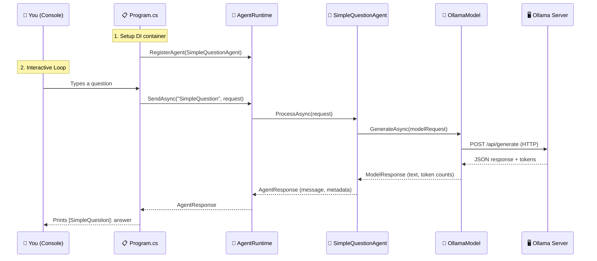
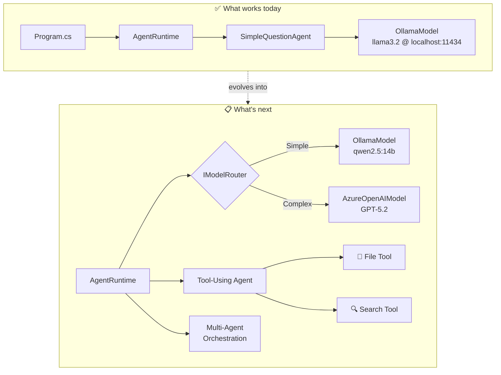

# AgenticLab Demo — Application Walkthrough

> What the demo does, how it works, and how all the pieces fit together.

---

## What Does the Demo Application Do?

The demo is an **interactive console chatbot** that:

1. Starts up and configures itself using .NET dependency injection
2. Connects to a **local LLM** running on your machine (Ollama)
3. Registers a **SimpleQuestionAgent** with the agent runtime
4. Opens an interactive loop where you type questions and get AI answers
5. Tracks token usage (prompt + completion tokens) for every interaction

It's the simplest possible agentic system — **one agent, one model, no tools** — designed to prove the entire pipeline works end-to-end before adding complexity.

---

## How It Works — Step by Step



---

## The 5 Projects — What Each One Does

```text
AgenticLab.sln
│
├── AgenticLab.Core          🧩 Abstractions (interfaces + data models)
│   ├── IAgent               — Contract for any agent
│   ├── IModel               — Contract for any LLM backend
│   ├── ITool                — Contract for any tool (not used yet)
│   ├── AgentRequest/Response — Messages between runtime and agents
│   └── ModelRequest/Response — Messages between agents and models
│
├── AgenticLab.Runtime       🔄 Orchestration engine
│   └── AgentRuntime         — Registers agents, routes requests, handles errors
│
├── AgenticLab.Models        🧠 LLM adapters
│   ├── OllamaModel          — Talks to local Ollama via HTTP (✅ implemented)
│   └── AzureOpenAIModel     — Talks to Azure OpenAI (🚧 placeholder)
│
├── AgenticLab.Agents        🤖 Concrete agents
│   └── SimpleQuestionAgent  — Takes a question, sends to LLM, returns answer
│
└── AgenticLab.Demos         🎬 Entry point (the app you run)
    └── Program.cs           — DI setup, agent registration, interactive loop
```

---

## Key Design Patterns in the Code

### 1. Dependency Injection (No Static Coupling)

```csharp
// Program.cs — everything is registered in the DI container
var services = new ServiceCollection();
services.AddSingleton<IModel>(sp => new OllamaModel(...));
services.AddTransient<SimpleQuestionAgent>();
services.AddSingleton<AgentRuntime>();
```

**Why?** Makes it trivial to swap Ollama for Azure OpenAI, or replace the agent — just change the registration.

### 2. Interface-Based Abstractions

```csharp
// The agent doesn't know or care if it's talking to Ollama, Azure, or vLLM
public class SimpleQuestionAgent : IAgent
{
    private readonly IModel _model;  // ← could be ANY model

    public async Task<AgentResponse> ProcessAsync(AgentRequest request, ...)
    {
        var response = await _model.GenerateAsync(...);  // ← polymorphic call
        return new AgentResponse { ... };
    }
}
```

**Why?** The agent is model-agnostic. Tomorrow you can plug in GPT-5.2 without changing agent code.

### 3. Runtime as Orchestrator

```csharp
// AgentRuntime routes requests to the right agent by name
runtime.RegisterAgent(agent);
var response = await runtime.SendAsync("SimpleQuestion", request);
```

**Why?** When you have multiple agents, the runtime decides who handles what. Foundation for multi-agent orchestration.

### 4. Structured Request/Response Models

```csharp
// Every layer has its own typed messages
AgentRequest  → { Message, Metadata, History }
AgentResponse → { AgentName, Message, Success, Metadata }
ModelRequest  → { Prompt, SystemPrompt, MaxTokens, Temperature }
ModelResponse → { Text, ModelName, PromptTokens, CompletionTokens }
```

**Why?** Clear boundaries. Agents speak "agent language", models speak "model language". No leaky abstractions.

---

## Data Flow — What Happens When You Ask "What is .NET?"

```text
┌─────────────────────────────────────────────────────────────────────┐
│ YOU type: "What is .NET?"                                           │
└──────────────────────────────┬──────────────────────────────────────┘
                               ▼
┌─────────────────────────────────────────────────────────────────────┐
│ Program.cs creates:                                                 │
│   AgentRequest { Message = "What is .NET?" }                        │
└──────────────────────────────┬──────────────────────────────────────┘
                               ▼
┌─────────────────────────────────────────────────────────────────────┐
│ AgentRuntime.SendAsync("SimpleQuestion", request)                   │
│   → Looks up agent by name in dictionary                            │
│   → Calls agent.ProcessAsync(request)                               │
└──────────────────────────────┬──────────────────────────────────────┘
                               ▼
┌─────────────────────────────────────────────────────────────────────┐
│ SimpleQuestionAgent.ProcessAsync(request)                           │
│   → Wraps your question into a ModelRequest:                        │
│     { Prompt = "What is .NET?",                                     │
│       SystemPrompt = "You are a helpful assistant...",              │
│       MaxTokens = 500, Temperature = 0.7 }                         │
│   → Calls _model.GenerateAsync(modelRequest)                       │
└──────────────────────────────┬──────────────────────────────────────┘
                               ▼
┌─────────────────────────────────────────────────────────────────────┐
│ OllamaModel.GenerateAsync(modelRequest)                             │
│   → HTTP POST to http://localhost:11434/api/generate                │
│     Body: { model: "llama3.2", prompt: "What is .NET?",            │
│             system: "You are a helpful assistant...",               │
│             stream: false, options: { temperature: 0.7 } }         │
│   → Reads JSON response                                            │
│   → Returns ModelResponse { Text = "...", PromptTokens, ... }      │
└──────────────────────────────┬──────────────────────────────────────┘
                               ▼
┌─────────────────────────────────────────────────────────────────────┐
│ Response flows back up:                                             │
│   ModelResponse → Agent wraps into AgentResponse                    │
│   AgentResponse → Runtime returns to Program.cs                     │
│   Program.cs → Prints: "[SimpleQuestion]: .NET is a..."            │
└─────────────────────────────────────────────────────────────────────┘
```

---

## What's NOT Implemented Yet (Roadmap)

| Feature | Status | Next Step |
|---------|--------|-----------|
| Single agent (SimpleQuestion) | ✅ Done | — |
| Ollama adapter | ✅ Done | — |
| AgentRuntime orchestration | ✅ Done | — |
| Azure OpenAI adapter | 🚧 Placeholder | Implement `GenerateAsync` |
| IModelRouter (hybrid routing) | 📋 Planned | Route local vs cloud |
| ITool usage (agents with tools) | 📋 Planned | File system, web search, code runner |
| Multi-agent collaboration | 📋 Planned | Agents delegating to each other |
| Conversation history/memory | 📋 Planned | `AgentRequest.History` is defined but unused |
| Configuration from appsettings | 📋 Planned | Replace hardcoded endpoint/model |
| vLLM adapter | 📋 Planned | OpenAI-compatible adapter |

---

## Running the Demo

### Prerequisites

```powershell
# 1. Install Ollama natively
winget install Ollama.Ollama

# 2. Pull a model
ollama pull llama3.2

# 3. Verify it's running
ollama list
```

### Run

```powershell
# From VS Code: press F5
# Or from terminal:
dotnet run --project src/AgenticLab.Demos
```

### Expected Output

```text
╔══════════════════════════════════════╗
║        AgenticLab — Demo             ║
║   Simple Question Agent              ║
╚══════════════════════════════════════╝

Registered agents: SimpleQuestion

Type a question (or 'quit' to exit):
─────────────────────────────────────

> What is an agentic system?

[SimpleQuestion]: An agentic system is a software architecture where
autonomous agents receive goals, plan how to achieve them, use tools
to take actions, and produce results with minimal human intervention...
```

---

## Architecture — Where This Is Heading



---

*AgenticLab Demo Walkthrough — February 2026*
