# Local LLMs & RAG — Specialist Agents for Real Work

> **Audience:** Managers & developers evaluating local AI for specialized business tasks  
> **Key message:** You don't need the cloud for everything. A local LLM + RAG pipeline, specialized for *your* domain, can handle 70-80% of AI workloads — privately, fast, and at zero API cost.

---

## Slide 1: The AI Landscape — What's What?

> Not every system with an LLM is "agentic." Understanding the differences helps you choose the right tool.


### The Four Levels of AI Systems

| Level | What It Is | How It Works | Runs Locally? |
|-------|-----------|-------------|:------------:|
| **LLM Chatbot** | A text generator with a system prompt | Query → LLM → Answer | ✅ Yes |
| **RPA + LLM** | Script-triggered automation that may use an LLM | Trigger → Fixed workflow → LLM step → Output | ⚠️ Partially |
| **RAG** | LLM augmented with your own documents | Query → Retrieve relevant docs → LLM answers using them | ✅ Yes |
| **Agentic AI** | Autonomous agent with memory, tools, and planning | Goal → Plan → Use tools → Evaluate → Iterate → Output | ✅ Yes |

---

#### Level 1: LLM Chatbot — "The Text Generator"

The simplest form. You send a prompt, the model generates a response. There is no memory between sessions, no access to your data, and no ability to take actions. Think of ChatGPT or a local Ollama chat — it only knows what it was trained on.

```text
  User: "What's our refund policy?"
  LLM:  "Generally, refund policies vary..." ← generic, possibly wrong
```

**Strength:** Fast, cheap, zero setup.  
**Weakness:** Hallucinations, no access to your documents, can't do anything — just talks.

---

#### Level 2: RPA + LLM — "The Script with a Brain"

Traditional automation (RPA) follows pre-coded scripts: "When X happens, do Y." Adding an LLM gives one step the ability to understand natural language — but the workflow itself is still rigid and pre-defined. The LLM can't change the plan.

```text
  Trigger: New email arrives
    → Step 1: Extract subject line (rule-based)
    → Step 2: LLM classifies intent (complaint / inquiry / order)
    → Step 3: Route to correct queue (rule-based)
```

**Strength:** Reliable, predictable, auditable.  
**Weakness:** Can't handle tasks it wasn't programmed for. Zero flexibility.

---

#### Level 3: RAG — "The Informed Answerer"

RAG (Retrieval-Augmented Generation) connects your LLM to your own data. Before generating an answer, the system searches a vector database of your documents, retrieves relevant chunks, and feeds them into the LLM prompt. The LLM now answers *from your data* instead of guessing.

```text
  User:  "What's our refund policy?"
  RAG:   1. Embeds the question as a vector
         2. Searches your policy documents → finds "Refund-Policy-v2.pdf §3.1"
         3. LLM reads the actual text and generates a grounded answer
  Answer: "Per Refund Policy v2 §3.1: Customers may request a full refund
           within 14 days of purchase..." ← accurate, citable
```

**Strength:** Accurate answers from YOUR knowledge base. Cites sources. No retraining needed.  
**Weakness:** Read-only — can answer questions but can't take actions or make decisions.

---

#### Level 4: Agentic AI — "The Autonomous Worker"

An agentic system goes beyond answering. It receives a **goal**, creates a **plan**, uses **tools** (APIs, databases, file systems), **evaluates** results, and **iterates** until the task is done. It has memory (remembers context), reasoning (chooses next steps), and autonomy (acts without step-by-step human instruction).

```text
  User: "Process all new invoices from the inbox and create CRM entries"
  Agent:
    1. PLAN:    "I need to check email, download attachments, extract data, create records"
    2. TOOL:    Checks inbox → 3 new invoices found
    3. TOOL:    Extracts data from each PDF (vendor, amount, date)
    4. EVALUATE: "Invoice #2 is missing vendor name" → flags for human review
    5. TOOL:    Creates CRM entries for invoice #1 and #3
    6. REPORT:  "2 invoices processed, 1 flagged for review"
```

**Strength:** Handles multi-step workflows autonomously. Uses tools. Makes decisions.  
**Weakness:** More complex to set up. Needs clear guardrails to avoid mistakes.

---

#### How They Stack — From Simple to Powerful

```text
                        Autonomy & Capability ──────────────────────▶

  ┌────────────┐    ┌────────────┐    ┌────────────┐    ┌────────────┐
  │  LLM       │    │  RPA + LLM │    │    RAG     │    │  Agentic   │
  │  Chatbot   │    │            │    │            │    │    AI      │
  ├────────────┤    ├────────────┤    ├────────────┤    ├────────────┤
  │ Talks      │    │ Follows    │    │ Answers    │    │ Plans      │
  │            │    │ scripts    │    │ from YOUR  │    │ Acts       │
  │ No memory  │    │ LLM in     │    │ documents  │    │ Uses tools │
  │ No data    │    │ one step   │    │ Cites      │    │ Evaluates  │
  │ No actions │    │ Rigid flow │    │ sources    │    │ Iterates   │
  └────────────┘    └────────────┘    └────────────┘    └────────────┘
    Cost: Free       Cost: $          Cost: $           Cost: $$
    Setup: Minutes   Setup: Days      Setup: 1-3 days   Setup: 3-5 days
    Risk: Low        Risk: Low        Risk: Low         Risk: Medium
```

> **The key insight:** Most business tasks sit at Level 3 (RAG). You only need Level 4 (Agentic) when the task requires *actions*, *decisions*, or *multi-step workflows*. Don't over-build.

### Key Insight for Managers

> You don't need an Agentic AI system for every task. Often a **local RAG** or a **simple specialist agent** is the right — and cheapest — answer.

### Key Insight for Developers

> Start with RAG. Move to agents only when you need planning, tool use, or multi-step reasoning. Over-engineering costs real money and time.

---

## Slide 2: How RAG Works — The Core Pattern

> RAG is the single most practical AI pattern for business use. It lets an LLM answer questions about *your* data — without retraining.

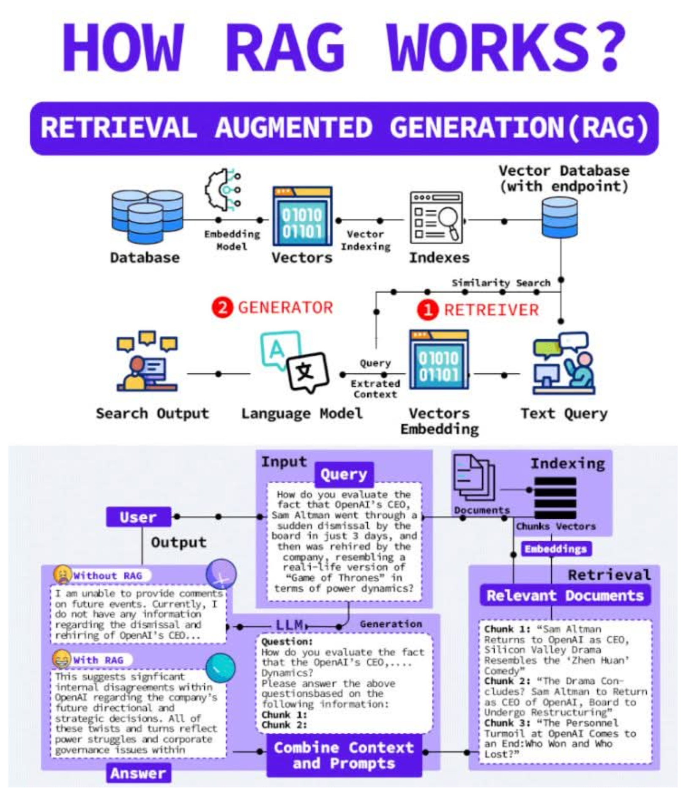

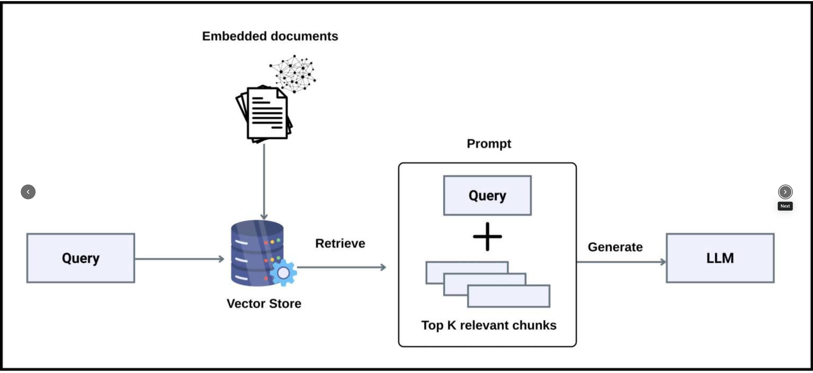

### The RAG Pipeline in 4 Steps

```text
 1. INGEST         2. EMBED           3. RETRIEVE         4. GENERATE
┌──────────┐    ┌──────────────┐    ┌──────────────┐    ┌──────────────┐
│ Your     │───▶│ Embedding    │───▶│ Vector Store │───▶│ LLM combines │
│ Documents│    │ Model splits │    │ finds top K  │    │ query + docs │
│ (PDF,    │    │ text into    │    │ most similar │    │ and generates│
│  Word,   │    │ vectors      │    │ chunks       │    │ grounded     │
│  HTML)   │    │              │    │              │    │ answer       │
└──────────┘    └──────────────┘    └──────────────┘    └──────────────┘
```

### Why RAG Matters For Your Business

| Without RAG | With RAG |
|-------------|----------|
| LLM invents answers (hallucination) | LLM answers from your actual documents |
| No access to internal knowledge | Searches your policies, manuals, specs |
| Generic, sometimes wrong | Specific, grounded, verifiable |
| Can't cite sources | Can point to exact documents and paragraphs |

### All of This Runs Locally

| Component | Local Solution | Cloud Alternative |
|-----------|---------------|-------------------|
| Embedding model | `nomic-embed-text` via Ollama | Azure OpenAI Embeddings |
| Vector store | ChromaDB, SQLite-vec, Qdrant | Azure AI Search |
| LLM | Gemma 3 4B, Qwen 2.5 14B via Ollama | Azure OpenAI GPT-4o |
| Document ingestion | .NET code, local file system | Azure Blob Storage |

---

## Slide 3: Local Specialist Agents — The Big Idea

> **A specialist agent is a small, focused AI worker trained and configured for ONE specific job.** It doesn't try to do everything — it does one thing excellently.

### The Analogy

Think of it like hiring staff:

| Approach | Analogy | Cost | Quality |
|----------|---------|------|---------|
| Cloud frontier model (GPT-5) | Hire a Harvard professor for every task | $$$$ | Excellent but overkill |
| Local specialist agent | Hire a trained clerk who knows your process | $ | Excellent for *that* specific task |

### What Can a Local Specialist Do?

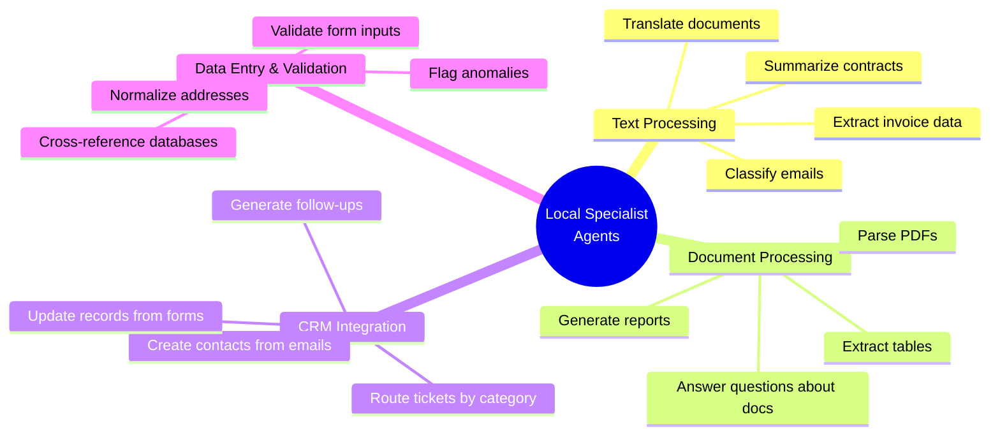

---

## Slide 4: Real-World Use Cases

### Use Case 1: Document Processing Agent

> **Problem:** Staff manually reads incoming invoices, types data into ERP.  
> **Solution:** Local agent extracts structured data from PDFs and creates entities via web service.

```text
┌──────────┐     ┌──────────────────┐     ┌────────────────┐     ┌──────────┐
│ Incoming │────▶│ Local Document   │────▶│ Validation &   │────▶│ CRM /    │
│ Invoice  │     │ Processing Agent │     │ Entity Mapping │     │ ERP via  │
│ (PDF)    │     │ (Llama 3.2 8B)   │     │                │     │ WebAPI   │
└──────────┘     └──────────────────┘     └────────────────┘     └──────────┘

Components (all local):
 • Ollama + Llama 3.2 8B    — understands document structure
 • RAG with invoice templates — knows YOUR document format
 • .NET agent with ITool     — calls CRM web service
 • Local file watcher        — triggers on new PDFs
```

**Manager bottom line:** No cloud costs, no data leaving your network, processes invoices in seconds.

### Use Case 2: CRM Entity Creation from User Input

> **Problem:** Sales reps describe new contacts in natural language (email or chat). Someone has to manually create the CRM record.  
> **Solution:** Local agent parses the natural language, extracts fields, and calls the CRM web service.

```text
 User input (email/chat):
 "Met Jan Novák from ACME s.r.o. at the Prague conference.
  He's their CTO, email jan.novak@acme.cz, interested in our
  enterprise plan. Follow up next Tuesday."

                    ▼

 ┌─────────────────────────────────────┐
 │  Local CRM Agent (Qwen 2.5 14B)    │
 │                                     │
 │  Extracts:                          │
 │   • Name: Jan Novák                 │
 │   • Company: ACME s.r.o.            │
 │   • Role: CTO                       │
 │   • Email: jan.novak@acme.cz        │
 │   • Interest: Enterprise plan       │
 │   • Follow-up: 2026-02-17           │
 └──────────────┬──────────────────────┘
                │
                ▼
 ┌─────────────────────────────────────┐
 │  ITool: CrmWebServiceTool           │
 │  POST /api/contacts                 │
 │  { "name": "Jan Novák", ... }       │
 └─────────────────────────────────────┘
```

**Manager bottom line:** Zero manual data entry, zero API costs, contact data stays on your network.

### Use Case 3: Internal Knowledge Base Q&A

> **Problem:** Employees can't find answers in 500+ internal policy documents.  
> **Solution:** Local RAG indexes all documents, employees ask questions in natural language.

```text
 Employee: "What's our vacation policy for contractors
            with more than 2 years of service?"

                    ▼

 ┌─────────────────────────────────────┐
 │  Local RAG Pipeline                 │
 │                                     │
 │  1. Embed question                  │
 │  2. Search vector store (ChromaDB)  │
 │  3. Retrieve: HR-Policy-v3.pdf §4.2 │
 │  4. LLM generates grounded answer  │
 └─────────────────────────────────────┘

                    ▼

 Answer: "According to HR Policy v3, section 4.2:
  Contractors with 2+ years of continuous service
  are entitled to 20 vacation days per calendar year..."
  
  📄 Source: HR-Policy-v3.pdf, page 12
```

**Manager bottom line:** Instant answers from your own documents, no cloud needed, employees stop bothering HR.

---

## Slide 5: RAG vs Agentic RAG — When to Upgrade

> Not every task needs an agent. But some tasks need more than simple RAG.

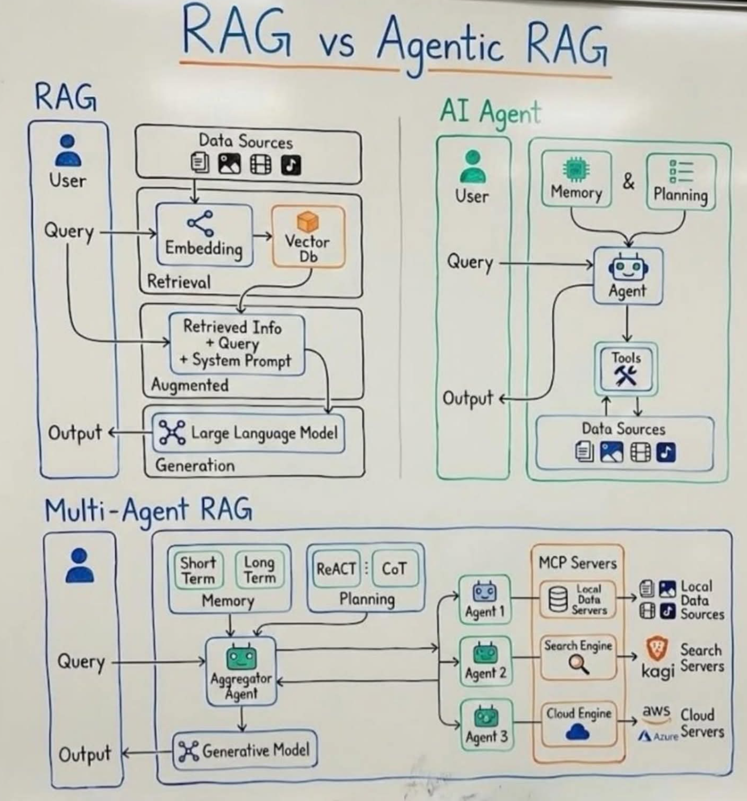

### Decision Matrix

| Scenario | Use RAG | Use Agent | Use Multi-Agent |
|----------|:-------:|:---------:|:---------------:|
| Answer questions from documents | ✅ | | |
| Classify incoming emails | ✅ | | |
| Process a document AND create a CRM entity | | ✅ | |
| Multi-step workflow with decisions | | ✅ | |
| Complex project: research + draft + review | | | ✅ |
| Route work between multiple specialists | | | ✅ |

### The Upgrade Path

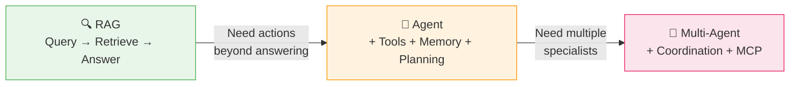

### Key Point: Start Simple

> 80% of real business problems are solved by RAG alone. Don't build a multi-agent system when a vector search + LLM will do.

---

## Slide 6: LLM vs RAG vs Agent vs Agentic AI — Full Comparison

> Understanding what you're building helps you avoid over-engineering and under-delivering.


### Simplified Comparison For Business Decisions

| Aspect | LLM | RAG | AI Agent | Agentic AI |
|--------|-----|-----|----------|------------|
| **What it does** | Generates text | Answers from your docs | Plans + acts + uses tools | Team of specialist agents |
| **Implementation** | Hours | 1-3 days | 3-5 days | 1-2+ weeks |
| **Runs locally?** | ✅ Easy | ✅ Easy | ✅ Yes | ⚠️ Complex |
| **Best for** | Quick text tasks | Document Q&A | Multi-step workflows | Full process automation |
| **Cost (local)** | Free | Free | Free | Free |
| **Cost (cloud)** | $ | $$ | $$$ | $$$$ |

### The AgenticLab Sweet Spot

```text
┌─────────────────────────────────────────────────────┐
│                                                     │
│   AgenticLab targets HERE ──────▶ ┌───────────┐    │
│                                   │ Local RAG  │    │
│   Simple ◀──────────────────────▶ │ + Focused  │    │
│   but powerful                    │ Agents     │    │
│                                   └───────────┘    │
│                                                     │
│   LLM ──── RAG ──── Agent ──── Agentic AI          │
│   ◄─── cheaper, simpler    complex, expensive ──►   │
│                                                     │
└─────────────────────────────────────────────────────┘
```

---

## Slide 7: Types of Language Models — Choose the Right One

> Not all LLMs are the same. Picking the right type for your specialist task saves cost and improves results.

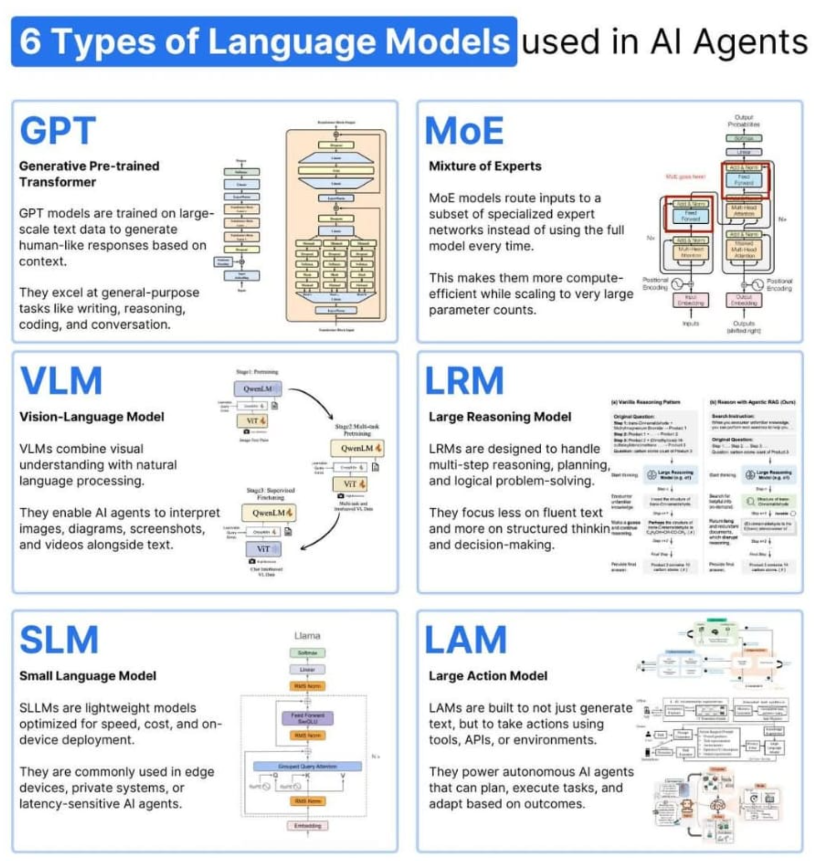

### Which Model Type for Which Specialist Task?

| Model Type | What It Excels At | Local Example | Specialist Use Case |
|------------|-------------------|---------------|---------------------|
| **GPT** (General) | Writing, reasoning, coding | Llama 3.2 8B, Qwen 2.5 14B | General text processing, CRM entity extraction |
| **MoE** (Mixture of Experts) | Efficient high-quality at scale | DeepSeek V3 (too large), Mixtral 8x7B | Not practical locally yet |
| **VLM** (Vision-Language) | Images + text understanding | LLaVA, Gemma 3 27B | Invoice scanning, diagram understanding |
| **LRM** (Large Reasoning) | Multi-step logic, planning | DeepSeek R1 32B, QwQ 32B | Complex document analysis, decision trees |
| **SLM** (Small Language) | Speed, edge deployment | Phi 4 Mini 3.8B, Gemma 3 1B | Classification, routing, quick lookups |
| **LAM** (Large Action) | Tool use, API calls, actions | — (emerging category) | CRM creation, system integration |

### Recommendation: Match Model to Task

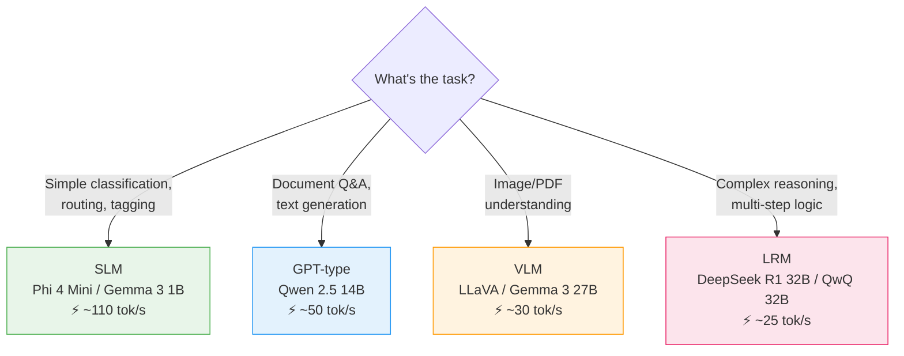

---

## Slide 8: Building Your Specialist Agent — The 8-Step Framework

> A practical roadmap for creating a local specialist agent.

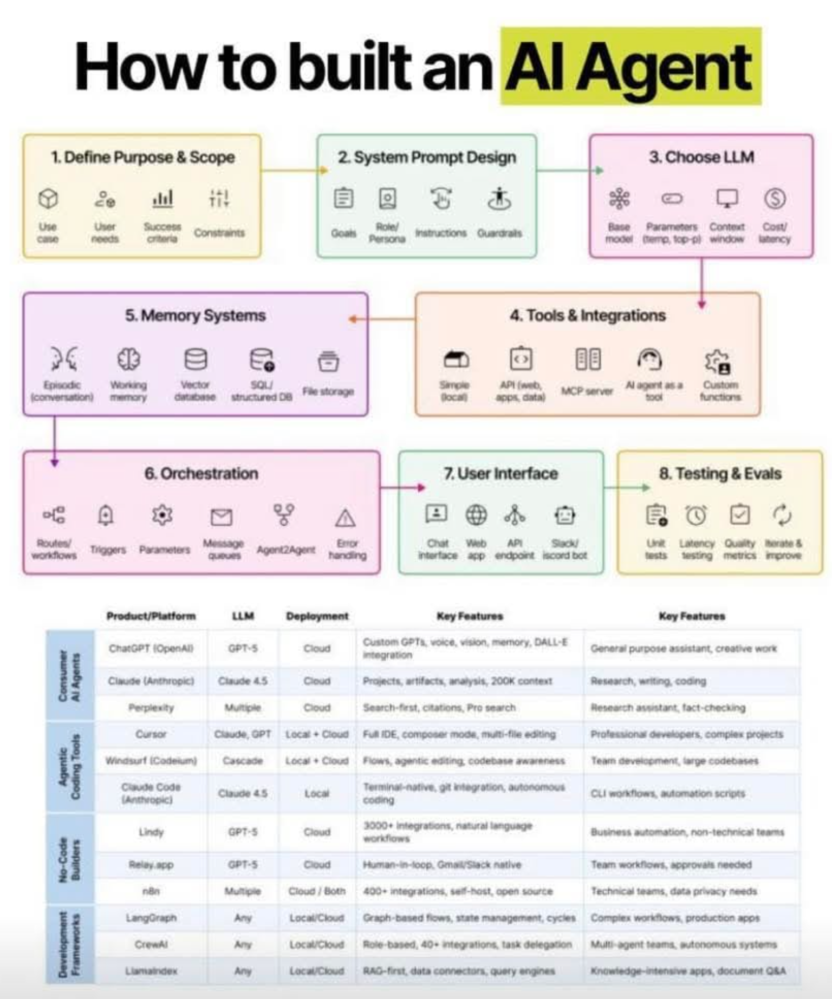

### Applied to a Local Specialist (e.g., CRM Agent)

| Step | What | For Our CRM Agent |
|------|------|-------------------|
| **1. Purpose & Scope** | Define USE CASE clearly | "Extract contact info from emails and create CRM records" |
| **2. System Prompt** | Set role, instructions, guardrails | "You are a CRM data entry specialist. Extract: name, company, email, role, notes." |
| **3. Choose LLM** | Pick the right local model | Qwen 2.5 14B via Ollama — good at extraction, fits in GPU |
| **4. Tools** | Define what actions the agent can take | `CrmWebServiceTool` — POST to CRM API |
| **5. Memory** | How the agent remembers context | Simple: conversation history. Advanced: vector store of past contacts |
| **6. Orchestration** | How requests flow | File watcher → Agent → Validation → CRM API |
| **7. User Interface** | How users interact | CLI for devs, Web API for integration, email inbox for end users |
| **8. Testing** | Validate quality | Test with 100 real emails, measure extraction accuracy |

### In AgenticLab Code

```csharp
// Step 1-2: Define the agent with purpose and system prompt
public class CrmContactAgent : IAgent
{
    public string Name => "CrmContact";
    public string Description => "Extracts contact info and creates CRM records";

    private readonly IModel _model;
    private readonly ITool _crmTool;

    public CrmContactAgent(IModel model, ITool crmTool)
    {
        _model = model;
        _crmTool = crmTool;
    }

    public async Task<AgentResponse> ProcessAsync(
        AgentRequest request, CancellationToken ct = default)
    {
        // Step 3: Use the local LLM to extract structured data
        var extraction = await _model.GenerateAsync(new ModelRequest
        {
            SystemPrompt = """
                You are a CRM data entry specialist.
                Extract these fields from the user's message as JSON:
                name, company, role, email, phone, notes, followUpDate.
                Return ONLY valid JSON.
                """,
            Prompt = request.Message,
            Temperature = 0.1  // Low temperature = precise extraction
        }, ct);

        // Step 4: Use the CRM tool to create the entity
        var result = await _crmTool.ExecuteAsync(new ToolInput
        {
            Name = "CreateContact",
            Parameters = new Dictionary<string, object>
            {
                ["contactJson"] = extraction.Text
            }
        }, ct);

        return new AgentResponse
        {
            AgentName = Name,
            Message = result.Success
                ? $"Contact created: {extraction.Text}"
                : $"Failed: {result.Error}",
            Success = result.Success
        };
    }
}
```

---

## Slide 9: Anatomy of an Agent — How IAgent + ModelRequest Works

> The secret to specialist agents: same LLM, different configuration = completely different behavior.

### What Is `IAgent`?

`IAgent` is the contract every agent implements. It has exactly three things:

```csharp
public interface IAgent
{
    string Name { get; }            // Identity — "CrmContact", "InvoiceProcessor"
    string Description { get; }     // What this agent does (for humans and routing)
    Task<AgentResponse> ProcessAsync(AgentRequest request, CancellationToken ct);
}
```

That's it. Every agent — from a simple Q&A bot to a BDI orchestrator — implements this one interface. The **runtime doesn't care** what the agent does internally; it just calls `ProcessAsync` and gets back a response.

### How `AgentRuntime` Orchestrates

```text
 ┌──────────┐     ┌──────────────────────────────────────┐     ┌──────────────┐
 │  User /   │     │           AgentRuntime               │     │    Agent     │
 │  System   │     │                                      │     │              │
 │           │────▶│  1. RegisterAgent(agent)              │     │ implements   │
 │           │     │     → stores agent by Name            │     │ IAgent       │
 │           │     │                                      │     │              │
 │           │────▶│  2. SendAsync("AgentName", request)   │────▶│ ProcessAsync │
 │           │     │     → finds agent in registry         │     │  → uses LLM  │
 │           │     │     → calls ProcessAsync              │     │  → uses Tools│
 │           │◀────│     → returns AgentResponse           │◀────│  → returns   │
 └──────────┘     └──────────────────────────────────────┘     └──────────────┘
```

### The Configuration That Makes It a Specialist

Inside `ProcessAsync`, the agent builds a `ModelRequest`. This is where a **generic LLM becomes a specialist**:

```csharp
var modelRequest = new ModelRequest
{
    Prompt       = request.Message,     // What the user asked
    SystemPrompt = "...",               // WHO the agent IS (the specialist role)
    MaxTokens    = 500,                 // How long the response can be
    Temperature  = 0.7                  // How creative vs precise
};
```

#### The Four Controls Explained

| Parameter | What It Does | Analogy |
|-----------|-------------|---------|
| **`Prompt`** | The user's actual input / question | The task you hand to the employee |
| **`SystemPrompt`** | Defines the agent's role, rules, and output format | The employee's job description and training |
| **`MaxTokens`** | Limits response length (1 token ≈ ¾ of a word) | "Keep your report under 2 pages" |
| **`Temperature`** | Controls randomness: 0.0 = precise, 1.0 = creative | "Follow the template exactly" vs "Be creative" |

#### Temperature: The Precision Dial

```text
 Temperature 0.0 ──────────────────────────────────── Temperature 1.0
 ◄── Deterministic                              Creative ──►

 0.0-0.2  "The capital of France is Paris."
           → Always the same answer. Best for DATA EXTRACTION.

 0.3-0.5  "Paris is the capital of France, located on the Seine."
           → Slight variation. Best for STRUCTURED Q&A.

 0.7      "Paris, the vibrant capital of France, is known for..."
           → Balanced. Best for GENERAL CONVERSATION.

 0.9-1.0  "Ah, Paris! City of Light, where every cobblestone..."
           → Highly creative. Best for WRITING, BRAINSTORMING.
```

### Same LLM, Three Different Specialists

All three agents below use the **exact same local Qwen 2.5 14B model**. Only the `SystemPrompt` and `Temperature` change:

```csharp
// 🏷️ CLASSIFIER AGENT — fast, deterministic
SystemPrompt = "Classify the email as: complaint, inquiry, order, or spam. Return ONE word only.",
MaxTokens    = 10,
Temperature  = 0.0     // Always the same classification for the same input

// 📄 DATA EXTRACTION AGENT — precise structured output
SystemPrompt = """
    You are a CRM data extraction specialist.
    Extract: name, company, email, role, phone, notes.
    Return ONLY valid JSON. No explanation.
    """,
MaxTokens    = 1000,
Temperature  = 0.1     // Near-deterministic, allows minor variation

// ❓ Q&A RAG AGENT — informative, natural language
SystemPrompt = """
    You are a helpful internal knowledge assistant.
    Answer questions using ONLY the provided document excerpts.
    Always cite the source document and section.
    If the answer is not in the documents, say "I don't have that information."
    """,
MaxTokens    = 2000,
Temperature  = 0.3     // Slightly varied phrasing, but grounded in docs
```

### For Managers: What This Means

```text
╔════════════════════════════════════════════════════════════════╗
║                                                                ║
║   You don't need to BUY different AI products for              ║
║   different tasks. You configure ONE local LLM with            ║
║   different "job descriptions" (SystemPrompt) and              ║
║   precision settings (Temperature).                            ║
║                                                                ║
║   Think of it as:                                              ║
║   • Same employee (the LLM)                                   ║
║   • Different training manuals (SystemPrompt)                  ║
║   • Different accuracy requirements (Temperature)             ║
║                                                                ║
║   Cost of adding a new specialist? $0 — it's just config.     ║
║                                                                ║
╚════════════════════════════════════════════════════════════════╝
```

### For Developers: The Pattern

```csharp
// Every specialist agent follows this pattern:
public class MySpecialistAgent : IAgent
{
    private readonly IModel _model;           // Injected — could be Ollama, Azure, anything
    private readonly ITool _myTool;           // Injected — the action this agent can take

    public async Task<AgentResponse> ProcessAsync(AgentRequest request, CancellationToken ct)
    {
        // 1. Call LLM with specialist config
        var llmResult = await _model.GenerateAsync(new ModelRequest
        {
            Prompt       = request.Message,
            SystemPrompt = "Your specialist instructions here",
            Temperature  = 0.1,             // Precise for data tasks
            MaxTokens    = 1000
        }, ct);

        // 2. (Optional) Use a tool to take action
        var toolResult = await _myTool.ExecuteAsync(new ToolInput
        {
            Name = "MyAction",
            Parameters = new() { ["data"] = llmResult.Text }
        }, ct);

        // 3. Return result
        return new AgentResponse
        {
            AgentName = Name,
            Message   = toolResult.Success ? "Done!" : $"Failed: {toolResult.Error}",
            Success   = toolResult.Success
        };
    }
}
```

> **The key insight:** `IAgent` is deliberately simple. All the intelligence is in the `SystemPrompt` + `Temperature` configuration and the tools you wire up. This makes agents easy to create, test, and swap.

---

## Slide 10: Architecture — How It All Fits Together

> The AgenticLab architecture is designed for local-first, specialist agents with optional cloud escalation.

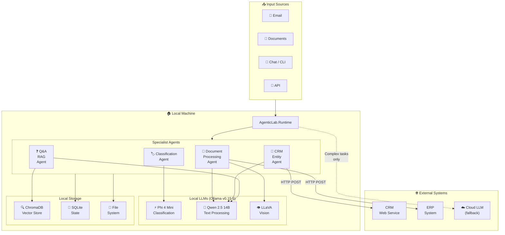

---

## Slide 11: Cost & Privacy — The Business Case

### Cost Comparison: 1 Specialist Task at Scale

> Scenario: Process 1,000 documents per day, extract data, create CRM entities.

| Approach | Monthly Cost | Data Privacy | Offline? | Vendor Lock-in |
|----------|-------------|:------------:|:--------:|:--------------:|
| **Cloud GPT-5.2** | ~$3,500/mo | ❌ Data sent to cloud | ❌ No | ✅ Yes |
| **Cloud GPT-5 mini** | ~$500/mo | ❌ Data sent to cloud | ❌ No | ✅ Yes |
| **Local Qwen 14B** | ~$15/mo (electricity) | ✅ All data stays local | ✅ Yes | ❌ No |
| **Local Phi-3 mini** | ~$10/mo (electricity) | ✅ All data stays local | ✅ Yes | ❌ No |

### Quality: Is Local Good Enough?

> For specialized, narrow tasks — **yes, absolutely.**

| Task Type | Cloud Model Quality | Local Specialist Quality | Notes |
|-----------|:------------------:|:-----------------------:|-------|
| General reasoning | ★★★★★ | ★★★☆☆ | Cloud wins for generalist tasks |
| **Document data extraction** | ★★★★★ | **★★★★☆** | Local is 90%+ as good with RAG |
| **CRM field extraction** | ★★★★★ | **★★★★★** | Structured extraction — local matches cloud |
| **Classification/routing** | ★★★★★ | **★★★★★** | Small models excel at classification |
| **Q&A from your docs (RAG)** | ★★★★★ | **★★★★☆** | Local RAG is remarkably effective |
| Creative writing | ★★★★★ | ★★★☆☆ | Cloud wins for creative tasks |
| **Repetitive data entry** | ★★★★★ | **★★★★★** | No difference — local is perfect |

### The Verdict for Managers

```text
╔═══════════════════════════════════════════════════════════════╗
║                                                               ║
║   For SPECIALIZED tasks with KNOWN document formats           ║
║   and DEFINED output structures:                              ║
║                                                               ║
║   ✅ Local LLMs perform at 90-100% of cloud quality           ║
║   ✅ At 0% of the API cost                                    ║
║   ✅ With 100% data privacy                                   ║
║   ✅ And zero internet dependency                             ║
║                                                               ║
║   The ROI is immediate.                                       ║
║                                                               ║
╚═══════════════════════════════════════════════════════════════╝
```

---

## Slide 12: Getting Started — What You Need

### Hardware (Developer/Small Team)

| Component | Minimum | Recommended | Our Setup |
|-----------|---------|-------------|-----------|
| CPU | 8 cores | 16+ cores | Intel Core Ultra 9 275HX (24 cores) |
| RAM | 32 GB | 64-192 GB | 192 GB DDR5 |
| GPU | 8 GB VRAM | 16-24 GB VRAM | NVIDIA RTX 5090 Laptop GPU 24 GB |
| Storage | 256 GB SSD | 1+ TB NVMe | 4 TB SSD |

### Software Stack

| Layer | Technology | Purpose |
|-------|-----------|---------|
| LLM Runtime | **Ollama** (v0.15.6) | Run local models with simple REST API |
| Models | **Qwen 2.5 14B**, **Phi 4 Mini** | Text processing, classification |
| Vector Store | **ChromaDB** or **SQLite-vec** | Document embeddings for RAG |
| Embeddings | **nomic-embed-text** (via Ollama) | Convert text to vectors |
| Application | **.NET 10 / C# 14** | Agent runtime (AgenticLab) |
| Orchestration | **AgenticLab.Runtime** | Manage agents, tools, routing |

### 5-Minute Quick Start

```bash
# 1. Install Ollama (v0.15.6+)
winget install Ollama.Ollama

# 2. Pull a specialist model
ollama pull qwen2.5:14b

# 3. Pull an embedding model for RAG
ollama pull nomic-embed-text

# 4. Test it works
ollama run qwen2.5:14b "Extract name, company, and email from: 
  'Hi, I'm Jana Dvořáková from TechCorp, reach me at jana@techcorp.cz'"

# 5. Verify models
ollama list
ollama ps

# 6. Clone and run AgenticLab
git clone https://github.com/your-org/agentinc-lab.git
cd agentinc-lab/src
dotnet run --project AgenticLab.Demos
```

---

## Slide 13: The Hybrid Escape Hatch

> Start local. Escalate to cloud only when you truly need it.

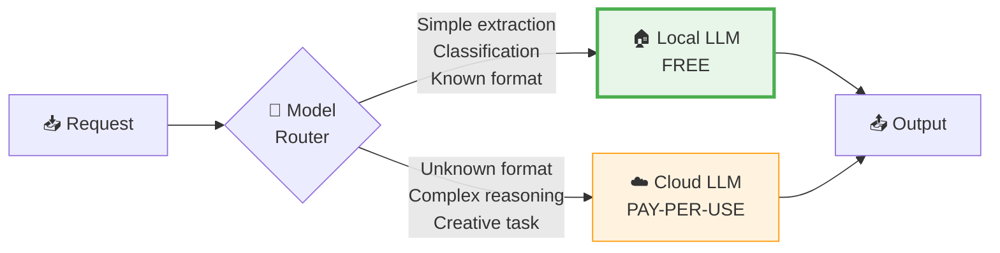

### Routing Rules in AgenticLab

```csharp
public class SpecialistModelRouter : IModelRouter
{
    public IModel SelectModel(AgentRequest request)
    {
        // Sensitive data ALWAYS stays local
        if (request.Metadata?.ContainsKey("sensitive") == true)
            return _localModel;

        // Known document formats → local specialist handles it
        if (request.Metadata?.ContainsKey("documentType") == true)
            return _localModel;

        // Simple classification → local is perfect
        if (request.Message.Length < 500)
            return _localModel;

        // Everything else → cloud (but this should be rare)
        return _cloudModel;
    }
}
```

### Expected Traffic Split

| Category | % of Requests | Route | Cost |
|----------|:------------:|:-----:|------|
| Document extraction (known formats) | 40% | Local | $0 |
| Classification & routing | 25% | Local | $0 |
| Simple Q&A from internal docs (RAG) | 15% | Local | $0 |
| Complex/unknown requests | 15% | Cloud | $$ |
| Creative/generative tasks | 5% | Cloud | $$ |
| **Total local** | **80%** | | **$0** |

---

## Slide 14: Practical Examples — Specialist Agent Patterns

### Pattern 1: Document → Structured Data → Web Service

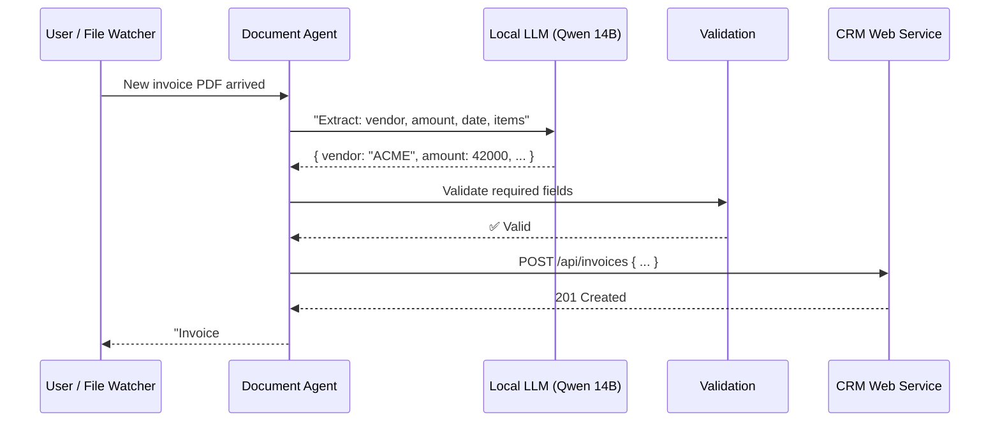

### Pattern 2: User Input → Entity Extraction → Multi-System Update

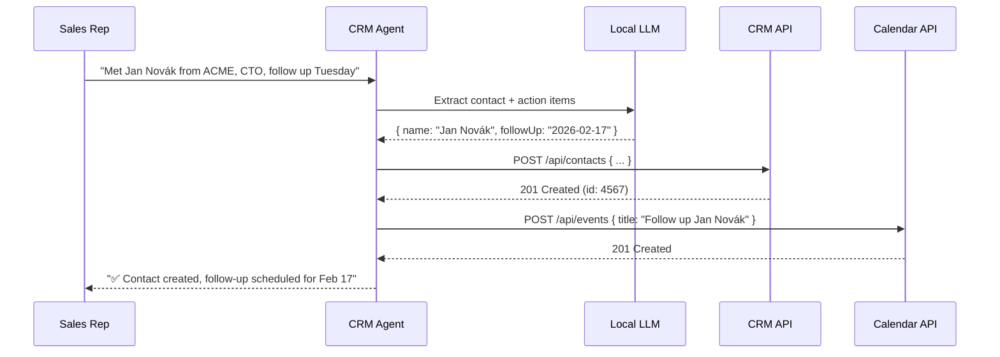

### Pattern 3: Internal Knowledge Q&A (RAG)

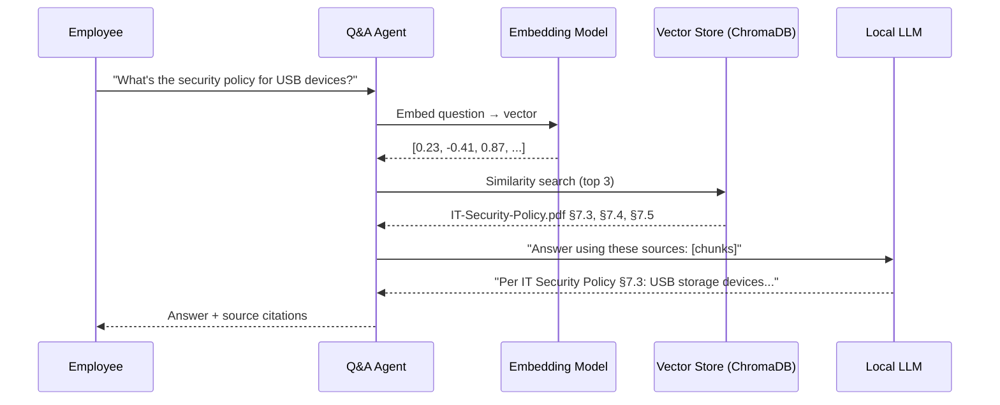

---

## Slide 15: Case Study — BDI (eOrder) to Agentic Workflow: CRM → SAP / Navision

> **Real-world scenario:** Your existing BDI (Bidirectional Interface) project handles CRM ↔ ERP integration today. A local specialist agent can automate the hardest part: **mapping generation and data transformation** — and make the interface self-adapting.

### The Problem: BDI Today

The current BDI (eOrder) interface moves data between CRM and ERP systems (SAP, Navision). But every new entity, field mapping, or XML/JSON structure requires **manual developer work**:

```text
 TODAY — Manual BDI Development Cycle
┌─────────────────────────────────────────────────────────────────────┐
│                                                                     │
│  1. Business request: "Send Opportunity + Quote to SAP"             │
│  2. Developer analyzes CRM entity schema (Opportunity, QuoteDetail) │
│  3. Developer reads SAP IDoc / Navision XMLport documentation       │
│  4. Developer manually writes C# mapping code                      │
│  5. Developer writes XML/JSON serialization                         │
│  6. Testing, fixing, deploying (days to weeks)                      │
│  7. Repeat for every new entity or target system                    │
│                                                                     │
│  ⏱️ Time per mapping: 2-5 days                                      │
│  💰 Cost per mapping: developer hours × rate                        │
│  🔄 Every change = manual rework                                    │
│                                                                     │
└─────────────────────────────────────────────────────────────────────┘
```

### The Solution: BDI Agent — Automated Mapping Generation

> A local specialist agent that **understands both the CRM schema and the ERP target format**, and generates the mapping code, XML structure, and transformation logic automatically.

```text
 FUTURE — Agentic BDI Workflow
┌─────────────────────────────────────────────────────────────────────┐
│                                                                     │
│  1. User says: "Map CRM Opportunity + Quote lines to SAP Sales     │
│     Order IDoc"                                                     │
│  2. Agent reads CRM schema (RAG: CRM metadata documents)           │
│  3. Agent reads SAP IDoc structure (RAG: SAP documentation)        │
│  4. Agent generates C# mapping code + XML structure                │
│  5. Agent validates output against XSD/schema                      │
│  6. Developer reviews, tests, deploys                              │
│                                                                     │
│  ⏱️ Time per mapping: 30 minutes (including review)                 │
│  💰 Cost: $0 API, minimal developer time                           │
│  🔄 Schema changes → re-run agent → new mapping                   │
│                                                                     │
└─────────────────────────────────────────────────────────────────────┘
```

---

### Architecture: BDI Agentic Workflow

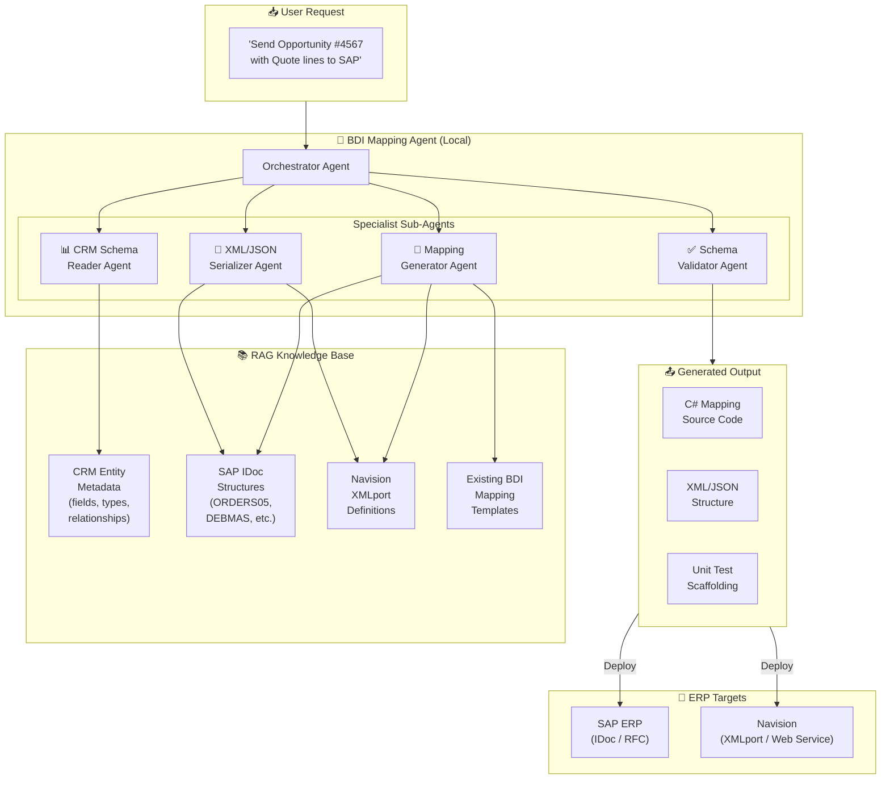

---

### Step-by-Step: CRM Opportunity + Quote → SAP Sales Order

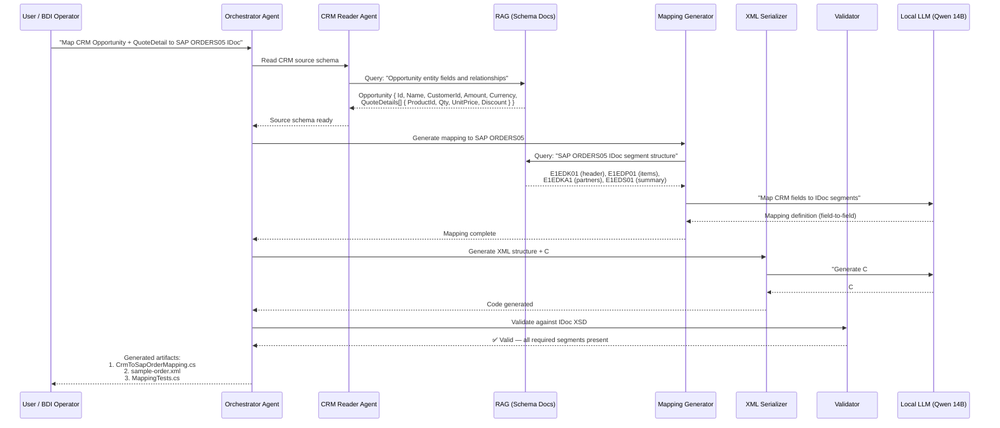

---

### What the Agent Generates — Concrete Example

#### Input: CRM Opportunity + Quote Data

```json
{
  "opportunity": {
    "id": "OPP-4567",
    "name": "ACME Enterprise License 2026",
    "customerId": "CUST-100",
    "customerName": "ACME s.r.o.",
    "amount": 285000.00,
    "currency": "CZK",
    "stage": "Won",
    "quoteDetails": [
      { "productId": "PRD-10", "productName": "Enterprise License", "qty": 50, "unitPrice": 5000.00, "discount": 0.10 },
      { "productId": "PRD-20", "productName": "Support Package",   "qty": 1,  "unitPrice": 35000.00, "discount": 0.00 }
    ]
  }
}
```

#### Output 1: Generated XML for SAP IDoc (ORDERS05)

```xml
<?xml version="1.0" encoding="UTF-8"?>
<ORDERS05>
  <IDOC BEGIN="1">
    <EDI_DC40 SEGMENT="1">
      <MESTYP>ORDERS</MESTYP>
      <IDOCTYP>ORDERS05</IDOCTYP>
      <SNDPRT>LS</SNDPRT>
      <SNDPRN>CRM_BDI</SNDPRN>
    </EDI_DC40>
    <E1EDK01 SEGMENT="1">
      <BELNR>OPP-4567</BELNR>
      <CURCY>CZK</CURCY>
      <WKURS>1.000</WKURS>
      <BSART>TA</BSART>
    </E1EDK01>
    <E1EDKA1 SEGMENT="1">
      <PARVW>AG</PARVW>
      <PARTN>CUST-100</PARTN>
      <NAME1>ACME s.r.o.</NAME1>
    </E1EDKA1>
    <!-- Line item 1 -->
    <E1EDP01 SEGMENT="1">
      <POSEX>000010</POSEX>
      <MENGE>50.000</MENGE>
      <MENEE>EA</MENEE>
      <MATNR>PRD-10</MATNR>
      <ARKTX>Enterprise License</ARKTX>
      <VPREI>5000.00</VPREI>
    </E1EDP01>
    <!-- Line item 2 -->
    <E1EDP01 SEGMENT="1">
      <POSEX>000020</POSEX>
      <MENGE>1.000</MENGE>
      <MENEE>EA</MENEE>
      <MATNR>PRD-20</MATNR>
      <ARKTX>Support Package</ARKTX>
      <VPREI>35000.00</VPREI>
    </E1EDP01>
    <E1EDS01 SEGMENT="1">
      <SUMME>285000.00</SUMME>
      <WAERQ>CZK</WAERQ>
    </E1EDS01>
  </IDOC>
</ORDERS05>
```

#### Output 2: Generated XML for Navision (XMLport)

```xml
<?xml version="1.0" encoding="UTF-8"?>
<SalesOrder xmlns="urn:microsoft-dynamics-nav/xmlports/salesorder">
  <SalesHeader>
    <DocumentType>Order</DocumentType>
    <No>OPP-4567</No>
    <SellToCustomerNo>CUST-100</SellToCustomerNo>
    <SellToCustomerName>ACME s.r.o.</SellToCustomerName>
    <CurrencyCode>CZK</CurrencyCode>
    <ExternalDocumentNo>OPP-4567</ExternalDocumentNo>
  </SalesHeader>
  <SalesLines>
    <SalesLine>
      <LineNo>10000</LineNo>
      <Type>Item</Type>
      <No>PRD-10</No>
      <Description>Enterprise License</Description>
      <Quantity>50</Quantity>
      <UnitPrice>5000.00</UnitPrice>
      <LineDiscountPercent>10</LineDiscountPercent>
    </SalesLine>
    <SalesLine>
      <LineNo>20000</LineNo>
      <Type>Item</Type>
      <No>PRD-20</No>
      <Description>Support Package</Description>
      <Quantity>1</Quantity>
      <UnitPrice>35000.00</UnitPrice>
      <LineDiscountPercent>0</LineDiscountPercent>
    </SalesLine>
  </SalesLines>
</SalesOrder>
```

#### Output 3: Generated C# Mapping Code

```csharp
/// <summary>
/// Auto-generated BDI mapping: CRM Opportunity → SAP ORDERS05 IDoc.
/// Generated by BDI Mapping Agent on 2026-02-09.
/// </summary>
public class CrmToSapOrderMapping : IBdiMapping
{
    public string SourceSystem => "CRM";
    public string TargetSystem => "SAP";
    public string DocumentType => "ORDERS05";

    public string MapToXml(CrmOpportunity opportunity)
    {
        var doc = new XDocument(
            new XElement("ORDERS05",
                new XElement("IDOC",
                    new XAttribute("BEGIN", "1"),
                    CreateHeader(opportunity),
                    CreatePartner(opportunity),
                    CreateLineItems(opportunity.QuoteDetails),
                    CreateSummary(opportunity)
                )
            )
        );
        return doc.ToString();
    }

    private XElement CreateHeader(CrmOpportunity opp) =>
        new("E1EDK01",
            new XAttribute("SEGMENT", "1"),
            new XElement("BELNR", opp.Id),
            new XElement("CURCY", opp.Currency),
            new XElement("WKURS", "1.000"),
            new XElement("BSART", "TA")
        );

    private XElement CreatePartner(CrmOpportunity opp) =>
        new("E1EDKA1",
            new XAttribute("SEGMENT", "1"),
            new XElement("PARVW", "AG"),
            new XElement("PARTN", opp.CustomerId),
            new XElement("NAME1", opp.CustomerName)
        );

    private IEnumerable<XElement> CreateLineItems(
        IList<QuoteDetail> lines) =>
        lines.Select((line, i) => new XElement("E1EDP01",
            new XAttribute("SEGMENT", "1"),
            new XElement("POSEX", ((i + 1) * 10).ToString("D6")),
            new XElement("MENGE", $"{line.Qty:F3}"),
            new XElement("MENEE", "EA"),
            new XElement("MATNR", line.ProductId),
            new XElement("ARKTX", line.ProductName),
            new XElement("VPREI", $"{line.UnitPrice:F2}")
        ));

    private XElement CreateSummary(CrmOpportunity opp) =>
        new("E1EDS01",
            new XAttribute("SEGMENT", "1"),
            new XElement("SUMME", $"{opp.Amount:F2}"),
            new XElement("WAERQ", opp.Currency)
        );
}
```

---

### AgenticLab Implementation: BDI Agent Tools

```csharp
/// <summary>
/// Tool that reads CRM entity metadata (schema, fields, relationships).
/// Feeds into RAG for the mapping agent to understand source data.
/// </summary>
public class CrmSchemaReaderTool : ITool
{
    public string Name => "CrmSchemaReader";
    public string Description => "Reads CRM entity schema for mapping generation";

    public async Task<ToolResult> ExecuteAsync(
        ToolInput input, CancellationToken ct = default)
    {
        var entityName = input.Parameters["entityName"]?.ToString();
        // Query CRM metadata endpoint or local schema cache
        var schema = await FetchEntitySchemaAsync(entityName!, ct);
        return new ToolResult { Output = schema, Success = true };
    }
}

/// <summary>
/// Tool that generates mapping code between two schemas.
/// Uses the LLM + RAG (ERP documentation) to produce correct output.
/// </summary>
public class MappingGeneratorTool : ITool
{
    public string Name => "MappingGenerator";
    public string Description => "Generates C# mapping code from CRM to ERP format";

    public async Task<ToolResult> ExecuteAsync(
        ToolInput input, CancellationToken ct = default)
    {
        var sourceSchema = input.Parameters["sourceSchema"]?.ToString();
        var targetFormat = input.Parameters["targetFormat"]?.ToString(); // "SAP_IDOC" | "NAV_XMLPORT"
        var targetDoc = input.Parameters["targetDocType"]?.ToString();   // "ORDERS05" | "SalesOrder"
        
        // Agent uses LLM to generate mapping code
        // RAG provides ERP documentation context
        var generatedCode = await GenerateMappingAsync(
            sourceSchema!, targetFormat!, targetDoc!, ct);
        
        return new ToolResult { Output = generatedCode, Success = true };
    }
}

/// <summary>
/// Tool that validates generated XML against XSD or schema rules.
/// </summary>
public class SchemaValidatorTool : ITool
{
    public string Name => "SchemaValidator";
    public string Description => "Validates generated XML/JSON against target ERP schema";

    public async Task<ToolResult> ExecuteAsync(
        ToolInput input, CancellationToken ct = default)
    {
        var xml = input.Parameters["xml"]?.ToString();
        var schemaType = input.Parameters["schemaType"]?.ToString();
        var errors = await ValidateAgainstSchemaAsync(xml!, schemaType!, ct);
        
        return new ToolResult
        {
            Output = errors.Count == 0 ? "Valid" : string.Join("\n", errors),
            Success = errors.Count == 0
        };
    }
}
```

---

### The Full BDI Agent Workflow — Orchestrator

```csharp
/// <summary>
/// BDI Orchestrator Agent: coordinates the full workflow of reading CRM data,
/// generating mappings, producing XML/JSON, and validating output for SAP/Navision.
/// </summary>
public class BdiOrchestratorAgent : IAgent
{
    public string Name => "BdiOrchestrator";
    public string Description => "Converts CRM Opportunity/Quote data to ERP format (SAP/Navision)";

    private readonly IModel _model;
    private readonly ITool _crmSchemaReader;
    private readonly ITool _mappingGenerator;
    private readonly ITool _schemaValidator;

    public BdiOrchestratorAgent(
        IModel model,
        [FromKeyedServices("CrmSchemaReader")] ITool crmSchemaReader,
        [FromKeyedServices("MappingGenerator")] ITool mappingGenerator,
        [FromKeyedServices("SchemaValidator")] ITool schemaValidator)
    {
        _model = model;
        _crmSchemaReader = crmSchemaReader;
        _mappingGenerator = mappingGenerator;
        _schemaValidator = schemaValidator;
    }

    public async Task<AgentResponse> ProcessAsync(
        AgentRequest request, CancellationToken ct = default)
    {
        // Step 1: Understand what the user wants
        var planResponse = await _model.GenerateAsync(new ModelRequest
        {
            SystemPrompt = """
                You are a BDI (Bidirectional Interface) specialist.
                Parse the user's request and return JSON with:
                - sourceEntity (e.g., "Opportunity", "Quote")
                - targetSystem (e.g., "SAP", "Navision")
                - targetDocType (e.g., "ORDERS05", "SalesOrder")
                - outputFormat (e.g., "XML", "JSON")
                Return ONLY valid JSON.
                """,
            Prompt = request.Message,
            Temperature = 0.1
        }, ct);

        // Step 2: Read CRM schema
        var schema = await _crmSchemaReader.ExecuteAsync(new ToolInput
        {
            Name = "CrmSchemaReader",
            Parameters = new() { ["entityName"] = "Opportunity" }
        }, ct);

        // Step 3: Generate mapping code
        var mapping = await _mappingGenerator.ExecuteAsync(new ToolInput
        {
            Name = "MappingGenerator",
            Parameters = new()
            {
                ["sourceSchema"] = schema.Output,
                ["targetFormat"] = "SAP_IDOC",
                ["targetDocType"] = "ORDERS05"
            }
        }, ct);

        // Step 4: Validate generated output
        var validation = await _schemaValidator.ExecuteAsync(new ToolInput
        {
            Name = "SchemaValidator",
            Parameters = new()
            {
                ["xml"] = mapping.Output,
                ["schemaType"] = "ORDERS05"
            }
        }, ct);

        return new AgentResponse
        {
            AgentName = Name,
            Message = validation.Success
                ? $"BDI mapping generated and validated:\n{mapping.Output}"
                : $"Mapping generated but validation failed:\n{validation.Output}",
            Success = validation.Success
        };
    }
}
```

---

### Before vs After: BDI Development

| Aspect | Before (Manual BDI) | After (BDI Agent) |
|--------|---------------------|-------------------|
| **New mapping** | 2-5 developer days | 30 min (agent generates, dev reviews) |
| **Schema change** | Manual rework, hours | Re-run agent, instant regeneration |
| **New ERP target** | Learn docs, write from scratch | Add ERP docs to RAG, agent adapts |
| **Testing** | Manual test case writing | Agent generates test scaffolding |
| **Knowledge retention** | In developer's head | In RAG knowledge base (permanent) |
| **Cost** | Developer hours × rate | $0 (local LLM) + minimal dev review |
| **Consistency** | Varies by developer | Consistent — same agent, same patterns |

### The Key Insight

```text
╔════════════════════════════════════════════════════════════════════╗
║                                                                    ║
║   The BDI agent doesn't REPLACE developers.                       ║
║   It automates the REPETITIVE parts:                               ║
║                                                                    ║
║   ✅ Reading schema documentation    → RAG handles this            ║
║   ✅ Field-to-field mapping          → LLM generates this          ║
║   ✅ XML/JSON structure creation     → LLM generates this          ║
║   ✅ Boilerplate C# code             → LLM generates this          ║
║   ✅ Validation against XSD          → Tool handles this           ║
║                                                                    ║
║   Developers focus on:                                             ║
║   🧠 Business logic, edge cases, review, and deployment           ║
║                                                                    ║
║   Result: 10x faster BDI development, zero cloud cost,            ║
║           all CRM/ERP data stays on your network.                  ║
║                                                                    ║
╚════════════════════════════════════════════════════════════════════╝
```

---

## Slide 16: Summary — Why Local Specialist Agents?

### For Managers

| Question | Answer |
|----------|--------|
| Is it cheaper? | **Yes.** $0 API costs vs $500-$30,000/mo for cloud. |
| Is the quality good enough? | **Yes.** For specialized tasks, local matches cloud at 90-100%. |
| Is our data safe? | **Yes.** Nothing leaves your network. Ever. |
| Can we scale? | **Yes.** Add more agents on the same machine, or add machines. |
| What if we need cloud later? | **Built in.** AgenticLab's `IModelRouter` switches in one config change. |
| How fast to implement? | **Days, not months.** RAG in 1-3 days, specialist agent in 3-5 days. |

### For Developers

| Question | Answer |
|----------|--------|
| What stack? | .NET 10, C# 14, Ollama (v0.15.6), ChromaDB, AgenticLab |
| Which model to start with? | Qwen 2.5 14B for general, Phi 4 Mini for classification |
| How do I add RAG? | Embed with `nomic-embed-text`, store in ChromaDB, retrieve top-K |
| How do I call external APIs? | Implement `ITool`, agent invokes it after LLM extraction |
| Can I test it? | Yes — all interfaces are mockable, design is DI-first |
| How do I go hybrid? | Implement `IModelRouter`, add Azure OpenAI adapter |

### The One-Liner

> **Run a local LLM specialized for your job. Add RAG for your documents. Connect tools for actions. Save money, keep data private, ship in days.**

---

## Slide 17: Next Steps

```text
 Week 1                    Week 2                    Week 3-4
┌──────────────────┐    ┌──────────────────┐    ┌──────────────────┐
│ ✅ Install Ollama │    │ 🔨 Build RAG      │    │ 🚀 Deploy first   │
│ ✅ Pull Qwen 14B  │    │    pipeline       │    │    specialist     │
│ ✅ Test extraction │    │ 🔨 Implement      │    │    agent          │
│ ✅ Run AgenticLab │    │    ITool for CRM  │    │ 🚀 Connect to     │
│    demos          │    │ 🔨 Test with real  │    │    real CRM API   │
│                   │    │    documents      │    │ 🚀 Measure ROI     │
└──────────────────┘    └──────────────────┘    └──────────────────┘
```

### Resources

- [AgenticLab Getting Started](tutorials/01-getting-started.md)
- [Local LLM Setup Guide](tutorials/02-local-llm-setup.md)
- [Build Your First Agent](tutorials/03-first-agent.md)
- [Local Architecture](architecture/local-agentic.md)
- [Hybrid Architecture](architecture/hybrid-agentic.md)
- [Main Presentation Deck](deck.md)

---

*AgenticLab — Local LLMs & RAG for specialized, real-world work.*
