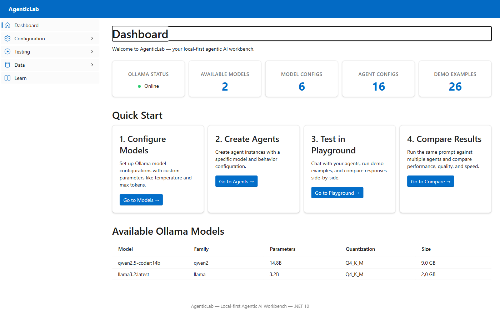
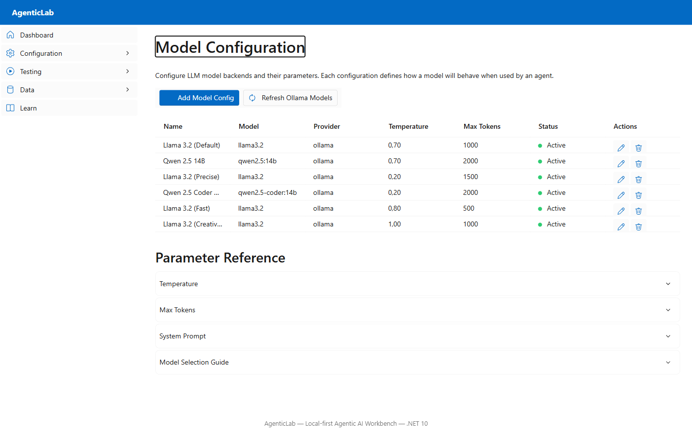
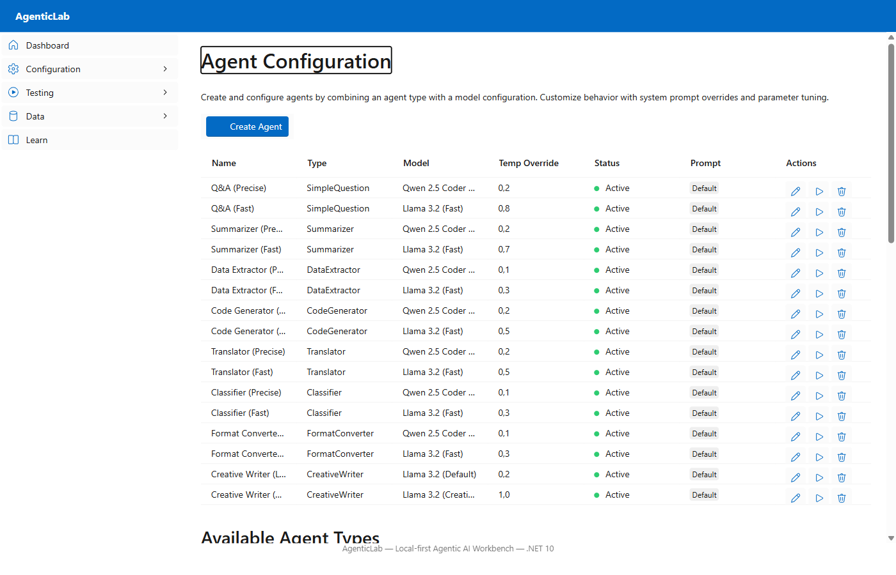
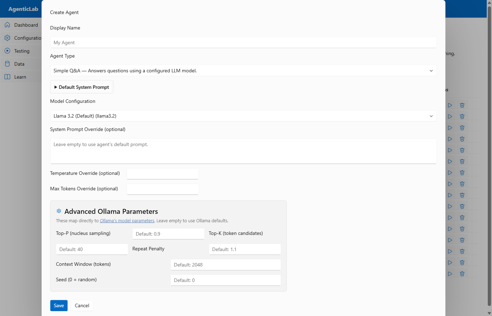
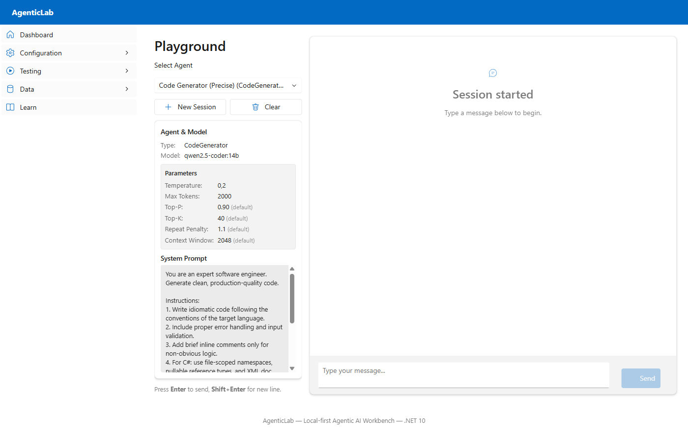
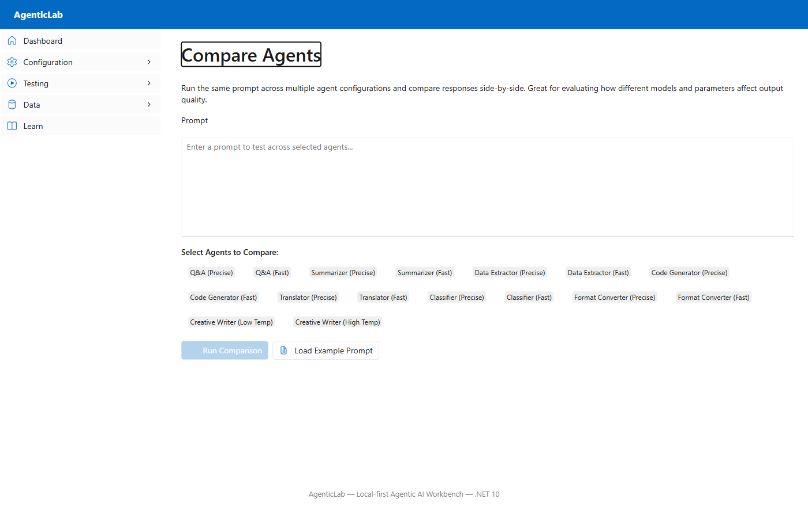
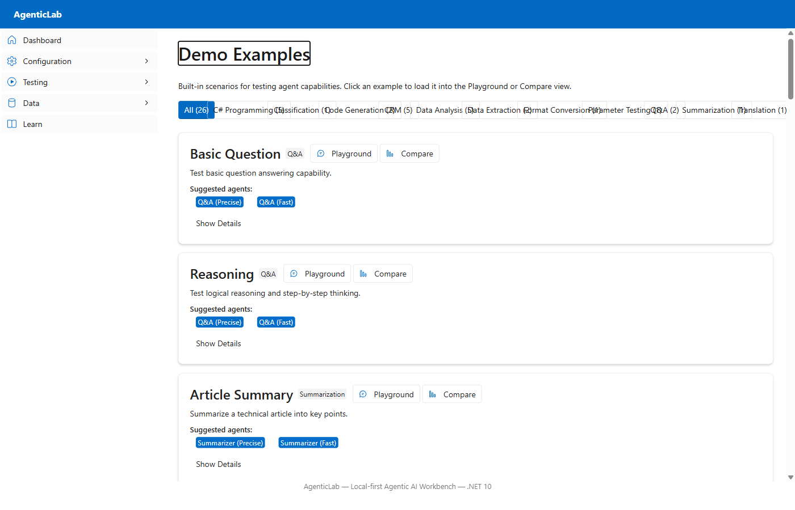

# AgenticLab Web Guide

> A step-by-step guide to configuring models, creating agents, testing prompts, and comparing results in the AgenticLab web interface.

## Prerequisites

- **Ollama** running locally at `http://localhost:11434` with at least one model pulled (e.g. `llama3.2`, `qwen2.5-coder:14b`)
- **AgenticLab.Web** running — start with:
  ```powershell
  dotnet run --project src/AgenticLab.Web
  ```
- Open `http://localhost:5210` in your browser

---

## 1. Dashboard Overview

The Dashboard is your starting point. It shows the health of your system at a glance.



**What you see:**

| Card | Description |
|------|-------------|
| **Ollama Status** | Whether Ollama is reachable (Online/Offline) |
| **Available Models** | Number of models pulled in Ollama |
| **Model Configs** | Number of model configurations defined |
| **Agent Configs** | Number of agent configurations defined |
| **Demo Examples** | Number of built-in example prompts |

The **Quick Start** section links you through the recommended workflow:

1. **Configure Models** — set up model parameters
2. **Create Agents** — combine a model with an agent type
3. **Test in Playground** — chat with your agent
4. **Compare Results** — run the same prompt across multiple agents

The **Available Ollama Models** table at the bottom shows every model Ollama has locally, including family, parameter count, quantization level, and size.

---

## 2. Configure Models

Navigate to **Configuration → Models** in the left sidebar.



### What is a Model Configuration?

A model configuration is a named preset that defines which Ollama model to use and what default parameters to apply. You can create multiple configurations for the same model with different parameter tuning.

### Default Configurations

AgenticLab ships with 6 pre-built model configurations:

| Config Name | Model | Temperature | Max Tokens | Use Case |
|-------------|-------|-------------|------------|----------|
| Llama 3.2 (Default) | `llama3.2` | 0.7 | 1000 | General purpose |
| Qwen 2.5 14B | `qwen2.5:14b` | 0.7 | 2000 | Higher quality |
| Llama 3.2 (Precise) | `llama3.2` | 0.2 | 1500 | Factual, deterministic |
| Qwen 2.5 Coder 14B (Precise) | `qwen2.5-coder:14b` | 0.2 | 2000 | Code generation |
| Llama 3.2 (Fast) | `llama3.2` | 0.8 | 500 | Quick responses |
| Llama 3.2 (Creative) | `llama3.2` | 1.0 | 1000 | Creative writing |

### Creating a Model Configuration

1. Click **Create Model Config**
2. Fill in the form:
   - **Display Name** — a human-readable name (e.g. "Qwen Fast")
   - **Model Name** — the exact Ollama model name (e.g. `llama3.2`, `qwen2.5-coder:14b`)
   - **Endpoint** — Ollama URL (default: `http://localhost:11434`)
   - **Temperature** — controls randomness (0.0 = deterministic, 1.0 = creative)
   - **Max Tokens** — maximum response length
   - **System Prompt** — default system instruction for this model
3. Click **Save**

### Tips

- **Lower temperature** (0.1–0.3) for factual answers, code, and data extraction
- **Higher temperature** (0.7–1.0) for creative writing and brainstorming
- **Max tokens** limits response length — set higher for code or detailed answers
- Use the Ollama model name exactly as shown in `ollama list`

---

## 3. Create Agents

Navigate to **Configuration → Agents** in the left sidebar.



### What is an Agent?

An agent combines an **agent type** (which defines its system prompt and behavior) with a **model configuration** (which defines which LLM to use and its parameters). You can also override specific parameters per agent.

### Agent List

The table shows all configured agents with their:
- **Name** — display name
- **Type** — the agent type (e.g. SimpleQuestion, CodeGenerator)
- **Model** — which model configuration it uses
- **Temp Override** — temperature override (or "Default")
- **Status** — Active/Inactive
- **Prompt** — shows "Custom" if a system prompt override is set, otherwise "Default"
- **Actions** — Edit, Test (opens Playground), Delete

### Available Agent Types

Below the table, you'll find cards for all 8 built-in agent types. Each card shows the type name, description, and a collapsible **System Prompt** section showing the default prompt.

| Agent Type | Purpose | Recommended Temperature |
|------------|---------|------------------------|
| **Simple Q&A** | Answers questions clearly and concisely | 0.3–0.7 |
| **Summarizer** | Summarizes text into structured key points | 0.2–0.4 |
| **Data Extractor** | Extracts structured data (JSON) from text | 0.1–0.3 |
| **Code Generator** | Generates production-quality code | 0.2–0.5 |
| **Translator** | Translates text between languages | 0.2–0.5 |
| **Classifier** | Classifies text into categories with reasoning | 0.1–0.3 |
| **Format Converter** | Converts data between formats (JSON, YAML, XML) | 0.1–0.3 |
| **Creative Writer** | Generates creative content (stories, poems) | 0.7–1.0 |

### Creating an Agent

Click **Create Agent** to open the configuration dialog:



**Form fields:**

1. **Display Name** — give your agent a descriptive name (e.g. "Code Generator (Precise)")
2. **Agent Type** — select from the dropdown. This determines the default system prompt and behavior.
3. **Default System Prompt** — click to expand and see the default prompt for the selected type
4. **Model Configuration** — choose which model and parameter preset to use
5. **System Prompt Override** — optionally write a custom system prompt (leave empty to use the agent type's default)
6. **Temperature Override** — optionally override the model's default temperature
7. **Max Tokens Override** — optionally override the maximum response length

#### Advanced Ollama Parameters

The bottom section exposes [Ollama model parameters](https://docs.ollama.com/modelfile) for fine-tuning:

| Parameter | Default | Description |
|-----------|---------|-------------|
| **Top-P** (nucleus sampling) | 0.9 | Controls diversity — lower values (0.5) are more focused, higher (0.95) more diverse |
| **Top-K** (token candidates) | 40 | Limits token selection — lower (10) is conservative, higher (100) is diverse |
| **Repeat Penalty** | 1.1 | Penalizes repeated tokens — increase to reduce repetition |
| **Context Window** (tokens) | 2048 | How much context the model considers — increase for long prompts |
| **Seed** | 0 (random) | Set a fixed number for reproducible outputs (same prompt = same answer) |

> **Tip:** Leave these empty to use Ollama's defaults. Only set them when you need specific behavior (e.g. set Seed for reproducible demos, increase Context Window for long documents).

Click **Save** to create the agent.

### Default Agent Configurations

AgenticLab ships with 16 pre-built agent configs — two per agent type:

- **Precise** variants use `qwen2.5-coder:14b` with low temperature (0.1–0.2)
- **Fast** variants use `llama3.2` with higher temperature (0.3–0.8) and lower max tokens

---

## 4. Test in Playground

Navigate to **Testing → Playground** in the left sidebar.



### Layout

The Playground has two columns:

**Left sidebar:**
- **Agent selector** — choose which agent to chat with
- **New Session / Clear** — start a fresh session or clear history
- **Agent & Model** — shows the selected agent's type and model
- **Parameters** — shows all active parameters (temperature, max tokens, top-p, top-k, repeat penalty, context window, seed) with "(default)" labels for non-overridden values
- **System Prompt** — displays the effective system prompt (shows "Custom" badge if overridden)

**Right panel:**
- **Chat area** — scrollable message history with user/assistant bubbles
- **Response metadata** — each response shows: agent name, model, duration (ms), and token count
- **Input area** — type your message and press **Enter** to send, **Shift+Enter** for a new line

### How to Test an Agent

1. **Select an agent** from the dropdown
2. A session is created automatically
3. Type a message in the input area
4. Press **Enter** or click **Send**
5. The agent will process your message and show the response with timing and token metrics
6. Continue the conversation — the agent maintains context within the session

### Quick Start from Examples

You can also jump to the Playground from the Examples page:
- Click **Playground** on any example card → opens Playground with the example prompt pre-filled
- Click a **suggested agent badge** → opens Playground with both the example and a matching agent selected

---

## 5. Compare Agents

Navigate to **Testing → Compare** in the left sidebar.



### What is Compare?

Compare lets you run the **same prompt** against **multiple agents simultaneously** and see the results side by side. This is great for:

- Evaluating how different models handle the same task
- Comparing the effect of temperature and parameter changes
- Measuring response speed and token usage across configurations

### How to Run a Comparison

1. **Enter a prompt** in the text area at the top
2. **Select agents** — click the checkboxes next to the agents you want to compare (select 2 or more)
3. Click **Run Comparison**
4. Wait for all agents to respond (they run in parallel)

### Reading Results

Each result card shows:
- **Agent name** and model used
- **Response text** — the full agent output
- **Timing** — how long the response took (ms)
- **Token usage** — prompt tokens + completion tokens
- **System prompt** — expandable section showing what system prompt was used
- **Success/Failure** indicator

### Tips

- Click **Load Example Prompt** to quickly insert a demo prompt
- Compare **Precise vs. Fast** variants of the same agent type to see the quality/speed trade-off
- Compare **different agent types** with the same prompt to see which approach works best
- Use the **Seed** parameter (set it in Agent configuration) for reproducible comparisons

---

## 6. Browse Examples

Navigate to **Testing → Examples** in the left sidebar.



### What are Examples?

AgenticLab includes 26 built-in demo examples across 10 categories. Each example has a ready-to-use prompt and suggested agents that are best suited for the task.

### Categories

| Category | Examples | Best Agent Type |
|----------|----------|----------------|
| Q&A | 2 | SimpleQuestion |
| Summarization | 1 | Summarizer |
| Data Extraction | 2 | DataExtractor |
| Code Generation | 2 | CodeGenerator |
| C# Programming | 5 | CodeGenerator |
| Translation | 1 | Translator |
| Classification | 1 | Classifier |
| Format Conversion | 1 | FormatConverter |
| Data Analysis | 5 | DataExtractor / CodeGenerator |
| CRM | 5 | Classifier / DataExtractor / CreativeWriter |

### Using Examples

Each example card shows:
- **Title** and **category badge**
- **Prompt text** — the full prompt you can send to an agent
- **Suggested agents** — clickable badges showing which pre-configured agents are recommended
- **Action buttons:**
  - **Playground** — opens the Playground with the prompt pre-filled
  - **Compare** — opens Compare with the prompt pre-filled
  - Click a **suggested agent badge** — opens Playground with both the prompt and that specific agent selected

### Filtering

Use the category filter buttons at the top to show only examples from a specific category, or click **All** to see everything.

---

## Workflow Summary

Here's the recommended end-to-end workflow:

```
┌──────────────────────────────────────────────────────┐
│  1. CONFIGURE MODELS                                 │
│     Set up Ollama model presets (temp, tokens, etc.) │
└────────────────────┬─────────────────────────────────┘
                     │
┌────────────────────▼─────────────────────────────────┐
│  2. CREATE AGENTS                                    │
│     Combine agent type + model config + overrides    │
│     Set advanced Ollama parameters if needed         │
└────────────────────┬─────────────────────────────────┘
                     │
┌────────────────────▼─────────────────────────────────┐
│  3. TEST IN PLAYGROUND                               │
│     Chat with your agent, iterate on prompts         │
│     Check timing and token metrics                   │
└────────────────────┬─────────────────────────────────┘
                     │
┌────────────────────▼─────────────────────────────────┐
│  4. COMPARE RESULTS                                  │
│     Run same prompt across multiple agents           │
│     Evaluate quality, speed, and parameter effects   │
└──────────────────────────────────────────────────────┘
```

### Parameter Tuning Guide

| Goal | Temperature | Top-P | Top-K | Repeat Penalty |
|------|-------------|-------|-------|----------------|
| Factual, deterministic answers | 0.1–0.3 | 0.5–0.7 | 10–20 | 1.2–1.5 |
| Balanced general use | 0.5–0.7 | 0.8–0.9 | 30–50 | 1.1 |
| Creative writing | 0.8–1.0 | 0.9–0.95 | 50–100 | 1.0 |
| Code generation | 0.1–0.3 | 0.7–0.8 | 20–40 | 1.2 |
| Data extraction (JSON) | 0.0–0.2 | 0.5–0.7 | 10–20 | 1.1 |
| Reproducible output | Any | Any | Any | Any + **Seed ≠ 0** |

> For more details on Ollama parameters, see the [Ollama Modelfile Reference](https://docs.ollama.com/modelfile).
